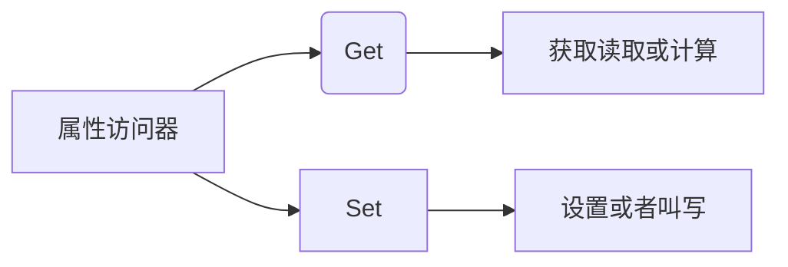

# C#



```c#
  class MapView {
        public string a1 {
            get { return a; }	//返回a的值
            set { a  = value ; } //将用户设置的值传递给a
        }

        private string a = "myname";
   }
```

```c#
 MapView m = new MapView();
 MessageBox.Show(m.a1);
 m.a1 = "xxl"; //用户设置的值
 MessageBox.Show(m.a1);
```

