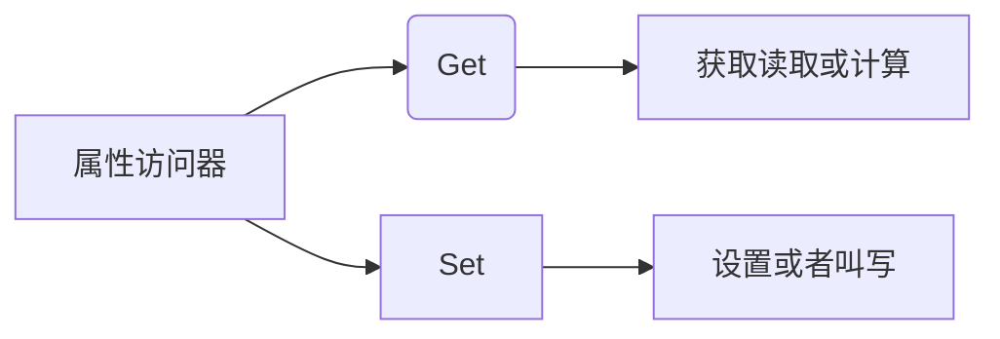

```
---
lang: zh-CN
title: 学习笔记
description: 页面的描述
---
```


# C/C++

## C++编程习惯与编程要点

参考：https://mp.weixin.qq.com/s/eFFc74OpA1ca2LlCB94Siw


### 代码注释

~~~c++
/**
 *  每一行都用一个*开始
 *  写好注释
 */
~~~

/*  */ 不能嵌套使用


## 腾讯代码安全指南

[Github 主页](https://github.com/Tencent/secguide)


## 字符转数字

~~~c
#include <stdio.h>

atof() // 转成浮点型
  
atoi() // 转成int型
~~~


## STL 


### 容器


#### array


#### bitset


#### deque


#### forward_list


#### list


#### map

1. 初始化

   ~~~cpp
   map<string, int> m1;
   ~~~

   


2. 插入

    ~~~c++
    m1.insert(pair<string, int>("xxl", 150));
    m1.insert(pair<string, int>("xxx", 125));
    ~~~

    ~~~c++
    m1.emplace("a", 10);
    m1.emplace("b", 20);
    ~~~


3. 遍历

    ~~~c++
    for (map<string, int>::iterator it = m1.begin(); it != m1.end(); it++) {
        cout << it->first << ", " << it->second << endl;
    }
    ~~~


#### queue

1. 初始化

   ~~~cpp
   queue<int> q;
   ~~~

   

2. 入队

   ~~~cpp
   q.push_back(100);
   ~~~

   


3. 出队

   ~~~cpp
   q.pop()
   ~~~

   

4. 获取队头元素

   ~~~cpp
   q.front();
   ~~~

   


#### set

1. 初始化

~~~c++

~~~


2. 插入

~~~c++

~~~


3. 遍历

~~~c++

~~~


#### stack

1. 初始化

   ~~~cpp
   stack<int> stk;
   ~~~

   ~~~cpp
   stack<int> stk {1, 2, 3}
   ~~~

   

2. 入栈

   ~~~cpp
   stk.push(100);
   ~~~

   

3. 弹栈

   ~~~cpp
   stk.pop();
   ~~~

   

4. 获取栈顶元素

   ~~~cpp
   stk.top();
   ~~~

   

5. 判断栈是否为空

   ~~~cpp
   stk.isEmpty();
   ~~~

   


#### unordered_map


#### unordered_set


#### vector

1. 初始化

   ~~~c++
   vector<int> v;
   ~~~

   ~~~cpp
   vector<int> v(10)	// 创建一个大小为10的数组
   ~~~

   ~~~cpp
   vector<int> v(10, 0)	// 创建一个大小为10, 且全部元素初始化为 0
   ~~~

   ~~~c++
   vector<int> v{ 1,2,3,4,5,6 };	// 设定元素
   ~~~

   

2. 插入

   ~~~cpp
   v.push_back(10);
   v.push_back(30);
   ~~~

   

3. 遍历

   ~~~cpp
   // 使用 at() 函数来遍历, 可以判断是否越界
   for (int i = 0; i < v.size(); i++) {
   	cout << v.at(i) << endl;
   }
   ~~~
   
    ~~~c++
    // 使用 [] 来遍历
    for (int i = 0; i < v.size(); i++) {
        cout << v[i] << endl;
    }
    ~~~

    ~~~c++
    // 使用迭代器来遍历
    for (vector<int>::iterator it = v.begin(); it != v.end(); it++) {
        cout << *it << endl;
    }
    
    // 使用自动判断类型
    for (auto it = v.begin(); it != v.end(); it++) {
        cout << *it << endl;
    }
    ~~~


## 纯字符串，去掉转义

~~~c++
std::string str = R"(aaaa\t\nbbbb)";
std::cout << str << std::endl;	// aaaa\t\nbbbb
~~~


## 常量指针和指针常量

### 常量指针

> 指针指向的内容是常量

~~~c++
const int *p = &a;
~~~


### 指针常量

> 指针是个常量

~~~c++
int * const p = &a;
~~~


## 使用 MSVC 编译代码


1. 打开适用于 vs2017 的 x64 本机工具命令提示
2. 输入`cl + "文件绝对路径"`     或者 输入 g++ 文件名 -o 输出文件名
3. 编译完成后，会生成可执行文件.exe，.obj是二进制代码
4. 输入文件名即可运行


## 读取二进制

~~~c++
#include <iostream>
#include <string>
#include <fstream>
using namespace std;

int main(){
    string fileName = "D:\\测试数据.dat";
    ifstream inFile(fileName, ios::in | ios::binary); //以二进制读方式打开
    char  *str;
    inFile.read(str,20);
    cout << str << endl;
    inFile.close();
    // char c;
    // while (inFile.get(c))
    // {
    //     cout << c ;
    // }
    
    cout << "finished !" << endl ;
}
~~~


## 自增和自减

### i++

先运算，再自增

~~~c++
x = i++;   //先让x变成i的值1，再让i加1
~~~

### ++i

先自增，再运算

~~~c++
x = ++i;   //先让i加1, 再让x变成i的值1
~~~


## 睡眠

Windows下

~~~c++
#include <windos.h>
Sleep(500); // 单位：毫秒
~~~


Linux下

~~~c++
#include <unistd.h>
sleep(5); // 单位：秒
~~~


通用：

~~~c++
#include <thread>
this_thread::sleep_for(chrono::seconds(1))
~~~


## 多线程

~~~c++
#include <thread>

void func1(int i){
    std::cout  << "T1" << i << std::endl;
}

void func2(){
    std::cout  << "T2" << std::endl;    
}

int main(){
    thread t1(func1, 100);
    thread t1(func2);    
    
    t1.join();
    t2.join();
}

~~~


## 	C/C++ 的编译链接

### 程序编译步骤


1. 预处理（Preprocessing）``gcc -E *.c > test.ii` ，会把预处理的内容保存到txt

   1. **预处理指令执行（头文件引入）**
   2. **宏展开**

2. **预编译**  ``g++ -S test.ii`, 会生成一个test.s文件，就是汇编代码

   1. 编译（Compilation）
   2. 汇编（Assembly）``g++ -c test.s`,linux生成.o，windows生成.obj，把汇编转成二进制

3. **编译**

   ~~~shell
   gcc -c *.c //生成目标文件
   ~~~

4. **链接（Linking）(多个文件链接成一个可执行文件)**

   ~~~shell
   gcc main.o add.o sub.o -o demo.exe
   ~~~

   ~~~sehll
   gcc *.o -o demo.exe
   ~~~

   


### 普通编译命令


C：

~~~shell
gcc -c main.c -o main
~~~

或者：(在linux平台也可以编译成.exe)

~~~shell
gcc -c main.c -o main.exe
~~~


C++：

~~~shell
g++ main.cpp -o mian.o
~~~


### GCC


### G++


### 多文件编译


~~~shell
gcc -c main.c     // 会生成一个.o文件
~~~

~~~shell
gcc -c add.c     // 会生成一个.o文件
~~~

~~~shell
gcc -c sub.c     // 会生成一个.o文件
~~~


链接：

~~~shell
gcc *.o -o demo
或者
gcc main.o add.o sub.o -o demo
~~~


但是这样一个文件对应一行的编译，效率很慢，而且当文件有几十个或者几百个时会很复杂、繁琐


### makefile

* linux下C/C++编程makefile应用广泛
* 编译移植开源项目，大部分开源项目都基于 makefile,学会 makefile 才能够调试编译过程中的问题
* 手写 makefile 太过于繁琐，自动生成的 makefile 不易于配置，学习本门课程编写自动化 makefile,以后新项目只需要include makefile头文件


#### make 和 makefile

* makefile文件主要包含了5部分内容：
  1. 显式规则。说明了如何生成一个或多个目标文件。由makefile文件的创作者指出，包括要生成的文件、文件的依赖文件、生成的命令。
  2. 隐式规则。由于make有自动推导的功能，所以隐式的规则可以比较粗糙地简略书写makefile文件，这是由make所支持的。
  3. 变量定义。在makefile.文件中要定义一系列的变量，变量一般都是字符串，这与C语言中的宏有些类似。当makefile文件执行时，其中的变量都会扩展到相应的引用位置上。
  4. 文件指示。其包括3个部分，一个是在一个makefile文件中引用另一个makefile文件；另一个是指根据某些情况指定makefile文件中的有效部分；还有就是定义一个多行的命令。
  5. 注释。makefile.文件中只有行注释，其注释用“#"字符。如果要在makefile文件中使用“#"字符，可以用反斜框进行转义，如：“\#”。


基本语法：

~~~makefile
目的:依赖
	通过依赖生成目的的命令
	
$@ ：代表的是目的
~~~


#### 创建

~~~shell
touch makefile
~~~

#### 编写

~~~makefile
math.exe: main.o add.o sub.o
	gcc main.o add.o sub.o -o demo.exe
main.o:main.c
	gcc -c main.c -o main.o
add.o:add.c
	gcc -c add.c -o add.o
sub.o:sub.c
	gcc -c sub.c -o sub.o
clean:
	rm -f *.o 
~~~

#### 开始编译

~~~shell
make
~~~


删除.o文件`make clean`


还有个优化：

`<` 会依次对应第一行写的.o文件，按照顺序进行编译

~~~makefile
math.exe: main.o add.o sub.o
	gcc *.o -o $@
%.o:%.c
	gcc -c $< -o $@
clean:
	rm -f *.o 
~~~


### makefile语法

#### 变量-常见	预定义变量


~~~shell
# first_make
# $^ 表示依赖  不重复
# $@ 表示目标
# @ 加在命令的前面表示不在终端打印出具体的语句 -加个横杠表示该行命令执行错误后继续往下执行
# 定义一个变量
TARGET=first_make
first_make:first_name.cpp
	$(CXX) $^ -o $@ -lpthread
2	
	
TARGET=first_make  # 目标文件
$(TARGET):first_make.cpp xdata.cpp
	@#-@rm test
	@echo "begin to build $(TARGET)"
	@$(CXX):WQ
    $^ -o $@ $(LIBS)
	@echo "$(TARGET) build success!"
	
	
TARGET=first_make  # 目标文件
LIBS=-lpthread     # 包含的一些库
OBJS=first_make.o xdata.o # 生成的二进制文件
CXXFLAGS=-I./include      # 在C++包含的头文件所在位置

$(TARGET):$(OBJS)  # 这就是定义变量的好处
	@#-@ rm test
	@echo "begin to build $(TARGET)"
	@$(CXX) $^ -o $@ $(LIBS)
	@echo "$(TARGET) build success!"
# 编译完成后，清理中间生成的文件   
clean:
	$(RM) $(OBJS) $(TARGET)
.PHONY: clean *.clean

~~~

要执行目标项，输入命令时要指定 `make clean`

一般用来清理掉，重新编译


### GCC编译动态链接库

所谓动态链接库，就是指在代码运行的过程中去加载的

* 动态库只会把动态库函数的地址复制过来，文件后缀是.so

* 而静态库会把所有的二进制代码都复制过去，因此静态库的文件会更大一些，文件后缀是.a


### 静态库


## 静态链表

定义<kbd>用数组来描述链表叫做静态链表</kbd>

* <font color="#629eb6">第一个元素游标存放的是备用链表的下标，第一个元素和最后一个元素不存放数据</font>
* <font color="#629eb6">数组的最后一位游标的设置为：第一位有数据的下标，下面表格的就是下标为1的才有数据</font>
* <font color="#629eb6">每一个元素的游标指向下一个元素的下标</font>

| 游标 |  5   |  2   |  3   |  4   |  5   |  6   |  7   | ...  |  1   |
| :--: | :--: | :--: | :--: | :--: | :--: | :--: | :--: | :--: | :--: |
| 数据 |      |  A   |  C   |  D   |  E   |      |      | ...  |      |
| 下标 |  0   |  1   |  2   |  3   |  4   |  5   |  6   | ...  | 999  |

~~~c++
#define MAXSIZE 100
typedef struct {
	string data; //数据
	int cur; //游标Cursor
}StaticLinkList[MAXSIZE];
~~~

**则对链表进行初始化相当于初始化数组：**

~~~c++
StaticLinkList s = {
	{"a",1},
	{"b",2},
    {"c",0} //最后一个元素的cursor指向0
};
int i = 0;
do {
	cout << s[i].data << endl;
	i = s[i].cur;
} while (i);
~~~

### 获取链表长度

~~~c++
int length(StaticLinkList s) {
	int count = 0,i = 0;
	do {
		i = s[i].cur;
		count++;
	} while (i);
	return count;
}
~~~

### 静态链表的插入操作

比如要把B插入A的后面，则

1. <font color="#6c96ca">找到没有数据的备用链表开头(获得空闲分量的下标)，下面的是5</font>
2. <font color="#6c96ca">让A的游标指向B的游标，也就是5</font>
3. <font color="#6c96ca">最后让B的游标指向C的游标，也就是3</font>


### 静态链表的删除操作

把要插入位置的前一个cursor指向下标为插入位置的cursor即可


### 实操案例

写一个完整的程序，实现随机生成20个元素的链表（尾插法、头插法任意），用快速查找法快速查找中间节点的值并显示

快速查找法：利用快慢指针原理：

设置连个节点`*serch、*mid`，都指向单链表的头节点，其中`*serch`的移动速度是`*min`的2倍。当`*search`指向末尾节点的时候，min就正好在中间了，这也是标尺的思想。


# Cmake

## 常用内置变量

* `CMAKE_SOURCE_DIR`：当前 CMakeLists.txt 文件所在的文件夹路径
* `CMAKE_BINARY_DIR`：对应 cmake 的 build 的目录，主要是运行时生成的文件目录
* `CMAKE_CURRENT_SOURCE_DIR`:一般来说，一个工程会有多个 CMakeLists.txt 文件，对应当前文件目录
* `CMAKE_CURRENT_BINARY_DIR`：对应 build 里的目录
* `CMAKE_ANDROID_ARCH_ABI`：当前 Android abi 架构目录


## 基础设置

### 设置工程名

~~~cmake
project("Demo")
~~~


### 最低支持的版本

~~~cmake
cmake_minimum_required(VERSION 3.10.2)
~~~


### 生成静态库和动态库

* SHARED：表示生成动态库（.so）
* STATIC：表示生成静态库（.a）

~~~cmake
add_library(nativeLib SHARED nativeLib.cpp)
~~~


### 批量导入源码文件

~~~cmake
file(GLOB ALL_FILE *.cpp *.c)
~~~

或者

~~~cmake
aux_source_directory(. ALL_FILE)
add_library(nativeLib SHARED ${ALL_FILE})
~~~


### 添加一个子目录并构建该子目录


`sub/CMakeLists.txt`

~~~cmake
cmake_minimum_required(VERSION 3.10.2)
project(sub)
add_library(sub test.cpp)

~~~

`CMakeLists.txt`

~~~cmake
cmake_minimum_required(VERSION 3.10.2)
project(test)

add_subdirectory(sub)
~~~


## 普通变量

### 定义

声明变量，CMake 中所有变量都是 string 类型

~~~cmake
Set(变量名, 变量值)
~~~


### 示例

把 var 赋值为 666

~~~cmake
set(var 66)
~~~


### 引用

~~~cmake
message("var = ${var}")
~~~


### 移除

移除之后，就不能再使用了

~~~cmake
unset(var)
~~~


## 列表变量

### 定义

~~~cmake
set(列表名 值1 值2 值3)
~~~

~~~cmake
set(列表名 "值1;值2;值3")
~~~


### 示例

~~~cmake
set(list_var 1 2 3 4 5 6)
~~~

~~~cmake
set(list_var "1;2;3;4;5;6")
~~~


## 条件判断


## 循环


## 函数定义


## 构建单个源文件

项目只有一个源文件，结构如下，我们一般会新建一个目录存储 cmake 运行的产物，这里我新建了一个 build 目录。

> ├── CMakeLists.txt
> ├── build
> └── main.cc


`main.cc` 的内容如下

~~~c
#include <stdlib.h>
#include <stdio.h>

int power(int num1, int num2) {
    return num1 * num2;
}

int main(int argc, char *argv[]) {
    if (argc < 3) {
        printf("Illegal parameters");
        return 1;
    }
    
    int num1 = atoi(argv[1]);
    int num2 = atoi(argv[2]);
    int result = power(num1, num2);
   
    printf("\n%d x %d = %d", num1, num2, result);
    putchar(20);

    return 0;
}
~~~


`CMakeLists.txt` 的内容如下：

~~~cmake
# Cmake的最低版本号的要求
cmake_minimum_required (VERSION 3.26)

# 项目信息---项目文件夹名称
project (project1)

# 指定生成目标---rrrr 是等会要生成的可运行程序名称
add_executable(rrrr main.cc)
~~~

在 build 目录下执行

~~~shell
cmake .. 
~~~


然后执行 make 命令就可以得到 rrrr 的可执行文件。

~~~shell
make
~~~


## 同一个目录，多个源文件

将 main.cc 的 power 函数抽取出来放到 MathFunctions.cc 中，项目结构如下：

> ├── CMakeLists.txt
> ├── MathFunctions.cc
> ├── MathFunctions.h
> ├── build
> └── main.cc


可以通过在 add_executable 命令中增加 MathFunctions.cc ，效果如下 

~~~cmake
add_executable(rrrr main.cc MathFunctions.cc)
~~~


但是如果有很多文件的情况下，一个文件一个文件的添加很麻烦，cmake 提供了 aux_source_directory 命令，该命令会查找指定目录下所有的源文件，然后将结果存到指定的变量名。CMakeLists.txt 文件内容如下


~~~cmake
# CMake 最低版本号要求
cmake_minimum_required (VERSION 3.26)

# 项目信息
project (project1)

# 查找目录下的所有源文件，并将名称保存到 DIR_SRCS 变量
aux_source_directory(. DIR_SRCS)

# 指定生成目标
add_executable(rrrr ${DIR_SRCS})
~~~


## 多个目录多个源文件

现在我们将 MathFounction.h 和 MathFounction.cpp 移动到 math 目录下，项目结构如下：

> ├── CMakeLists.txt
> ├── build
> ├── main.cc
> └── math
>   ├── CMakeLists.txt
>   ├── MathFunctions.cc
>   └── MathFunctions.h


这种情况我们需要在 project1 目录下和 math 目录下各自编写一个 CmakeLists.txt 文件，我们可以将 math 目录里面的文件编译成静态库再由 main 函数调用。 


`math/CMakeLists.txt`

~~~cmake
# 查找当前目录下的所有源文件, 并将名称保存到 DIR_LIB_SRCS 变量
aux_source_directory(. DIR_LIB_SRCS)

# 指定生成 MathFunctions 链接库  将src目录中源文件编译为静态链接库
add_library (MathFunctions ${DIR_LIB_SRCS})
~~~


`CMakeLists.txt`

~~~cmake
# 最低版本要求
cmake_minimum_required(VERSION 3.26)  

# 项目信息
project(project1)

set(CMAKE_INCLUDE_CURRENT_DIR ON)

# 是否使用自己的 MathFunctions 库
option(USE_MYMATH
    "Use provided math implementation" ON
)

# 加入一个配置头文件，用于处理 CMake 对源码的设置
configure_file(
    "${PROJECT_SOURCE_DIR}/config.h.in"
    "${PROJECT_SOURCE_DIR}/config.h"
)

# 是否加入 MathFunctions 库
if(USE_MYMATH)
    include_directories("${PROJECT_SOURCE_DIR}/math")
    
    # 指明本项目包含一个子目录 math，这样，math 目录下的 CMakeLists.txt 文件和源代码也会被使用
    add_subdirectory(math)
    
    set(EXTRA_LIBS ${EXTRA_LIBS} MathFunctions)
endif(USE_MYMATH)

# 查找当前目录下的所有源文件，并将名称保存到 DIR_SRCS 变量
aux_source_directory(. DIR_SRCS)

# 指定生成目标
# target_link_libraries 指明可执行文件需要链接一个名为 MathFunctions 的链接库。
add_executable(rrrr ${DIR_SRCS})
target_link_libraries(rrrr ${EXTRA_LIBS})
~~~

* option 命令添加了一个 USE_MYMATH 选项，并且默认值为 ON。之后根据 USE_MYMATH 变量的值决定是否使用我门自己编写的 MathFounctions 库。


* configure_file 命令用于加入一个配置文件 config.h，这个文件由 CMake从config.h.in 生成，这样的机制可以通过预定义一些参数和变量来控制代码的生成，config.h.in 内容如下：

  ~~~c
  #cmakedefine USE_MYMATH
  ~~~

  


然后需要更改 main.cc 文件让其根据 USE_MYMATH 的值确定是否调用标准库，内容如下：

`main.cc`

~~~c
#include <stdlib.h>
#include <stdio.h>
#include <config.h>

#ifndef USE_MYMATH
    #include <MathFunctions.h>
#else
    #include <math.h>
#endif


int main(int argc, char *argv[]) {
    if (argc < 3) {
        printf("Illegal parameters");
        return 1;
    }
    
    int num1 = atoi(argv[1]);
    int num2 = atoi(argv[2]);
    int result = power(num1, num2);
   
    printf("\n%d x %d = %d\n\n", num1, num2, result);
    putchar(20);


    return 0;
}
~~~


# Shell


# Python


## 操作数据库

### MySQL


### Redis

~~~shell
pip install redis
~~~

#### 连接

```python
import redis

con = redis.StrictRedis(
	host='127.0.0.1',
    port=6379,
    db=4, # 数据库默认没有名字，通过0-15来表示，一共16个
    decode_response=True
)
```


## 爬虫

### 代理

代理的使用形式

~~~python
proxies_dict = {
    "http": "http://" + ip:端口,
    "https":"https://" + ip:端口,
}
~~~


### XPath


可以安装这个插件，辅助书写xpath


~~~shell
// 			表示跨节点
~~~

~~~shell
div[]		 表示选择div标签，里面	@id	@class	可以根据id和class定位
~~~

示例：

~~~shell
//div[@class="nl_con clearfix"]/ul/li       表示定位到div标签下的ul，再往下定位到li，符合要求的在网页用黄色高亮
~~~


但是选择的有两条内容是广告，标签包含style属性，可以利用  `[not(@属性)]`  将其剔除

~~~shell
//div[@class="nl_con clearfix"]/ul/li[not(@style)]
~~~


继续往下获取，获取a标签的文本和链接

~~~shell
//div[@class="nl_con clearfix"]/ul/li[not(@style)]//div[@class="nlcd_name"]/a/text()  
~~~

~~~shell
//div[@class="nl_con clearfix"]/ul/li[not(@style)]//div[@class="nlcd_name"]/a/@href
~~~


#### contains

取包含 '某文字' 三个字的节点

~~~shell
//ul[@id="uid"]/li/a[contains(text(), "某文字")]
~~~

取 id 包含 'uu' 三个字的节点

~~~shell
//ul[@id="uid"]/li/a[contains(@id, "uu")]
~~~


#### start-with

~~~shell
//ul[@id="uid"]/li/a[start-with(@id, "uu")]
~~~


#### ends-with

~~~shell
//ul[@id="uid"]/li/a[ends-with(@id, "uu")]
~~~


### CSS 选择器


| 选择class :            | #             |      |
| ---------------------- | ------------- | ---- |
| 选择id :               | .             |      |
| 选择标签属性           | a::attr(href) |      |
| 只需要标签里的文字内容 | a::text       |      |


```python
name = i.css('.odd a::text').get()  # 获取标签文本
href = i.css('.odd a::attr(href)').get() # 获取标签属性
author = i.css('.odd:nth-child(3)::text').get() # 如果有相同的，可以用:nth-child()来确定位置
```


css选择器结合正则表达式

~~~shell
title = selector.css("title::text").re("(\S\S)")[0]
print title
# 百度
~~~


## 文件路径操作

获取当前 py 文件的绝对路径：

~~~python
p1 = os.path.abspath(__file__)
返回当前文件的绝对路径
存在软连接时,返回软连接文件路径
~~~

~~~python
p2 = os.path.realpath(__file__)
返回当前文件的标准路径，而非软链接所在的路径
~~~


## 操作 Windows


### 操作剪贴板

~~~shell
pip install pyperclip
~~~


### 调用 Windows API

~~~shell
pip install pypiwin32
~~~


#### 根据窗口标题找窗口


#### 切换窗口

~~~python
def switch_roles(hwnd):
    """
    功能: 切换窗口
    参数 hwnd: 窗口句柄, 十六进制的六位数字
    """
    ctypes.windll.user32.SwitchToThisWindow(hwnd, True)
    win32gui.ShowWindow(hwnd, win32con.SW_SHOWNORMAL)
    win32gui.SetForegroundWindow(hwnd)
~~~


### 调用 Windows 10 / 11 通知

~~~shell
pip install win10toast
pip install win11toast
~~~


## 第三方包的使用

### colorama

> 打印带颜色

~~~shell
 pip install colorama
~~~

~~~python
from colorama import init, Style, Back, Fore

# 初始化
init(autoreset=True)

print(
    Style.BRIGHT + 
    Back.YELLOW +  
    Fore.RED + 
    "Colorama ")
~~~


### pyinstaller

> 将 Python 代码打包成可执行文件 .exe

~~~shell
 pip install colorama
~~~


### httpx

> 支持 http 2.0 的请求库

~~~shell
 pip install httpx
~~~

~~~python
from random import randint
import asyncio
from time import sleep
from concurrent.futures import ThreadPoolExecutor
from httpx import AsyncClient


async def Request():
    try:
        async with AsyncClient() as h:  # 异步请求
            res = await h.post(url="https://www.70461.uk/getip.php")
            print(res.json(), sep='\n')
    except TimeoutError:
        print('连接超时')
    finally:
        return


def main():
    tasks = [Request() for _ in range(100)]  # 创建10个任务
    done, pending = asyncio.run(asyncio.wait(tasks))  # 运行任务


while True:
    try:
        with ThreadPoolExecutor() as thread:
            for _ in range(100):  # 创建100个线程
                thread.submit(main)  # 提交任务
        sleep(randint(0, 5))
    except Exception:
        print('运行出错')
        continue
~~~


### isort

> 自动整理 import 

~~~shell
 pip install isort
~~~


### openpyxl

> 读写 Excel 文件 (.xlsx)

~~~shell
pip install openpyxl
~~~

[参考](!http://t.csdn.cn/PXF1i)


1. 打开 Excel 文件

   ~~~python
   from openpyxl import load_workbook
   wb = load_workbook('./模板.xlsx', read_only=True, data_only=True)	# 只读、只读数据
   ws = wb[wb.sheetnames[0]]	# 获取第一个工作表 选择表（sheet）
   ~~~

   

2. 获取最大行数、列数

   ~~~python
   ws.max_row
   ws.max_column
   ~~~

   

3. 单元格访问

   ~~~python
   ws.cell(row=1, column=3).value
   ~~~

4. 遍历

   ~~~shell
   for val in ws_write.iter_rows(min_row=1):
       print(val[0].value, val[1].value)
   ~~~

   ~~~shell
   for row in range(1, ws.max_row + 1):
       print(ws.cell(row=row, column=3).value)
   ~~~

   


### PyTorch

~~~shell
pip install torch==1.8.0 torchvision==0.9.0 torchaudio==0.8.0
~~~


## 进程、线程、进程池、线程池


### 进程 Process

#### 进程的介绍

进程是实现多任务的一种方式。通俗地说，一个程序就相当于一个进程，一个进程又可以有许多的线程。

一般一个软件对应一个进程，但有些软件可以有多个进程，比如Chrome浏览器，每一个标签页就是一个进程。


也就是操作系统进行资源分配的基本单位，按软件进行分配。


下图演示的是一个py文件创建3个进程，一个进程负责一个任务，那么就可以多任务执行了。


#### 创建多进程

~~~python
import multiprocessing #导入多任务处理包

def dance():
    print("跳舞")

def sing():
    print("唱歌")

if __name__ == '__main__': # 主进程
    # 创建进程
    dance_process = multiprocessing.Process(target=dance)
    sing_process = multiprocessing.Process(target=sing)

    # 启动进程执行对应的任务，它们是同时执行的
    dance_process.start()
    sing_process.start()
~~~

当上面的代码运行时，会创建**3个进程**，一个主进程，2个子进程(dance，sing)


#### 获取当前进程的编号

~~~python
os.getpid()
~~~

~~~python
import os
def dance():
    print('跳舞函数的编号是：',os.getpid())
    print("跳舞")

def sing():
    print('唱歌函数的编号是：',os.getpid())
    print("唱歌")
~~~


#### 获取父进程的编号

~~~python
os.getppid()
~~~

~~~python
def dance():
    print('跳舞函数的编号是：', os.getpid())
    print('跳舞函数的父进程编号是：', os.getppid())
    print("跳舞")

def sing():
    print('唱歌函数的父进程编号是：', os.getppid())
    print('唱歌函数的编号是：', os.getpid())
    print("唱歌")
~~~


#### 开启进程给函数传参

方法一：利用args，传的是元组

~~~python
 sing_process = multiprocessing.Process(target=sing, args=(10,))
~~~

方法二：利用kwargs，传的是字典

~~~python
 sing_process = multiprocessing.Process(target=sing, kwargs={'data':10})
~~~


~~~python
def sing(data):
    print('唱歌函数的父进程编号是：', os.getppid())
    print('唱歌函数的编号是：', os.getpid())
    print("唱歌")

if __name__ == '__main__':
    print('主进程的进程编号是',os.getpid())
    # 创建进程
   
    sing_process = multiprocessing.Process(target=sing, args=(data,)) # 用args，元组的形式传参，一个元素的元组，要加逗号

    # 启动进程执行对应的任务
    dance_process.start()
~~~


#### 进程注意事项

* 进程之间不共享全局变量

~~~python
import time
import multiprocessing
g_list = [] # 全局变量

def add_data(): # 添加数据
    for i in range(5):
        g_list.append(i)
        print("添加数据",i)
        time.sleep(0.2)

def read_data(): # 读取数据
    print("读取数据",g_list)

if __name__ == '__main__':
    print(g_list) # 仍然是空
    one_process = multiprocessing.Process(target=add_data)
    two_process = multiprocessing.Process(target=read_data)
    # 启动进程执行对应的任务
    one_process.start()
    two_process.start()
    
 虽然add_data() 添加了数据，但是在read_data()进程里g_list 仍然是空的，尽管主进程也是空的
~~~

* 主进程会等待所有子进程结束才结束


#### 进程池

~~~python
from cocurrent.fetures import ProcessPoolExecutor

def function(val):
    ...
    ...

pp = ProcessPoolExecutor(max_workers=5)

for i in range(5):
    pp.submit(function, i)

pp.shutdown()

~~~


### 线程 Thread

#### 基本介绍

比如说百度网盘，下载是一个线程，上传也是一个线程，在线看视频也是一个线程，它们可以同时进行。

```python
import threading # 导入线程包

def task():
    time.sleep(1)
    print('当前线程',threading.current_thread().name)
    
 # 创建多(子)线程的方式
sub_thread = threading.Thread(target=task)

# 开启线程
sub_thread.start()    
```


如果待执行函数带有参数，则可以通过*args*和*kwargs* 来传参

例如：

~~~python
def dance(cout):
    for i in range(cout):
        print('跳舞')
        time.sleep(1)
dance_thread = threading.Thread(target=dance, args=(2,)) # 给函数传参，方法一
dance_thread = threading.Thread(target=dance, kwargs={'cout':3}) # 给函数传参，方法二,通过字典形式
~~~


由于主线程会等待所有子线程执行结束再结束，有时候不方便，我们可以设置当主线程结束后，顺便将所有子线程也结束掉。

* 方法一：在创建时设定daemon为True

~~~python
sub_thread = threading.Thread(target=show_info, daemon=True) # 守护线程，主线程结束则所有子线程也结束
~~~

* 方法二：创建好之后使用setDeamon(True)即可

~~~python
 sub_thread.setDaemon(True)
~~~


#### 线程池

~~~python
import threading

def function():
    ...
    ...

threads = []
for file in os.listdir('./csv_file'):
    t = threading.Thread(target=function, args=(file,))
    threads.append(t)

if __name__ == '__main__':
    for thr in threads:
        thr.start()
        thr.join()

~~~

~~~python
from cocurrent.fetures import ThreadPoolExecutor

def function(val):
    ...
    ...

tp = ThreadPoolExecutor(max_workers=5)

for i in range(5):
    tp.submit(function, i)

tp.shutdown()
~~~


#### 线程同步的方式

* 方法一：线程等待

~~~python
sub_thread.join() # 表示sub_thread这个线程执行完成后再执行下一个线程
~~~

* 方法二：互斥锁

可以给线程加一个锁，每次使用先开锁，使用过程加上锁，这样别的线程就无法用。但是加上锁之后就变成了单任务了，同一时刻只有一个线程在执行任务，性能会降低。但是能保证多线程使用全局变量的时候不会出现错误。


#### 线程之间共享全局变量

~~~python
g_list = [] # 全局变量

def add_data():
    for i in range(5):
        g_list.append(i)
        print('添加数据:',i)
        time.sleep(0.2)

def read_data():
    print('读取数据:',g_list)
    
add_thread = threading.Thread(target=add_data)
read_thread = threading.Thread(target=read_data)
add_thread.start()
add_thread.join()
read_thread.start()
~~~


#### 实例

~~~python
import threading # 导入线程包

g_sum = 0

def sum_num1():
    for i in range(1000000):
        global g_sum
        g_sum += 1
    print('sum1',g_sum) 
        
def sum_num2():
    for i in range(1000000):
        global g_sum
        g_sum += 1
    print('sum2',g_sum) 
    
    one_thread = threading.Thread(target=sum_num1)
    two_thread = threading.Thread(target=sum_num2)
    one_thread.start()
    one_thread.join() # 线程等待，这样都输出2000000
    two_thread.start()
~~~


### 协程 Coroutine

#### asyncio

~~~python
~~~


### 进程和线程的对比


① 线程之间的执行是无序的,由操作系统去调度具体的线程，进程之前也是无序的

② 进程之间不会共享全局变量,线程之间共享全局变量


### 多进程、多线程、多协程对比

[参考教程](https://www.cnblogs.com/chichung/p/9566734.html)

一个进程可以启动N个线程

一个线程可以启动N个协程


~~~python
'''多进程 Process (multiprocessing)'''

	* 优点：可以利用多核CPU进行并行运算
    * 缺点：占用资源最多、可启动数目比线程少
    * 适用于：CPU密集型计算
~~~

~~~python
'''多线程 Thread (threading)'''

	* 优点：相比进程，更轻量级、占用资源少
    * 缺点：
    		① 相比进程，多线程只能并发执行，不能利用多CPU（python有GIL）
        	② 相比协程，启动数目有限制，占用内存资源，有协程切换开销
    * 适用于：IO密集型计算、同时运行的任务数目要求不多
~~~

~~~python
'''多协程 Coroutine (asyncio)'''

	* 优点：内存开销最小、启动协程数量最多
    * 缺点：支持的库有限制(aiohttp vs requests)、代码实现复杂
    * 适用于：IO密集型计算、需要超多任务执行、但有现成库的场景
~~~


### 到底应该选择哪个来用？


## Web 框架


###　Django

python打开json文件

~~~python
with open("CoorOfXiaoqu.json",'w') as file_obj:
	json.dump(result_dict,file_obj)
~~~

python保存json文件

~~~python
import json
with open('文件名.json','w') as file:
        json.dump(数据,file)
~~~


#### 跨域

~~~shell
pip install django-cors-headers
~~~


<kbd>settings.py</kbd>

~~~python
# 跨域设置
CORS_ALLOW_CREDENTIALS=True
CORS_ORIGIN_ALLOW_ALL=True

# 以安装的应用
INSTALLED_APPS = [
    'corsheaders',
	...
]

MIDDLEWARE = [
    # 定义跨域中间件
    'corsheaders.middleware.CorsMiddleware',
    'django.middleware.common.CommonMiddleware',
	...
]

~~~

#### 配置局域网访问

~~~python
ALLOWED_HOSTS = ['*']
~~~


#### 配置安装的APP

~~~python
INSTALLED_APPS = [
    'django.contrib.admin',
    'django.contrib.auth',
    'django.contrib.contenttypes',
    'django.contrib.sessions',
    'django.contrib.messages',
    'django.contrib.staticfiles',
    'gis', #自己新建的APP，要添加进来
]
~~~


#### 配置数据库

~~~python
# 数据库使用PostgreSQL
DATABASES = {
    'default': {
    'ENGINE': 'django.db.backends.postgresql_psycopg2',
    'NAME': 'citygis',
    'USER': 'postgres',
    'PASSWORD': '123',
    'HOST': 'localhost',
    'PORT': '5432',
  }
}
~~~

~~~python
# 数据库使用MySQL
DATABASES = {
'default':{
      'ENGINE' : 'django.db.backends.mysql',
      'USER': 'root',
      'PASSWORD' :'root',
      'NAME' : 'citygis',#数据库名
      'HOST' : '127.0.0.1',
      'PORT' : 3306,
      'CHARSET' : 'utff-8',
  }
}
~~~

```python
# 数据库使用SQLite----默认就是用这个
DATABASES = {
'default': {
      'ENGINE': 'django.db.backends.sqlite3',
      'NAME': BASE_DIR / 'db.sqlite3',
  }
}
```

配置完成要迁移数据库：

~~~shell

~~~


#### 配置语言和时区

~~~python
LANGUAGE_CODE = 'zh-hans'

TIME_ZONE = 'Asia/Shanghai'

USE_I18N = True

USE_L10N = True

USE_TZ = False
~~~


#### 配置静态模板

~~~python
# 静态文件配置

STATIC_URL = '/static/'  # 别名
STATICFILES_DIRS = (
    os.path.join(BASE_DIR, 'app1/templates/static'),
)
# Static files (CSS, JavaScript, Images)
# https://docs.djangoproject.com/en/3.2/howto/static-files/
~~~


#### 模板HTML写法

~~~html
  
<!doctype html>
<html lang="en">
<head> 
    <link rel="stylesheet" href="" />
    <script src=""> </script>
~~~


### 上传文件并解析内容

利用表单，上传文件，

​	*acition:文件上传的地址，后台需要实现对应接口*

​    *method：数据提交的方式，必须为POST*

​    *enctype：发送数据类型，上传文件时必须为multipart/form-data*  

~~~html
<form class="upload" id="upload" action="http://127.0.0.1:8000/api/show" method="POST" enctype="multipart/form-data">
  <div class="container">
    <input type="file" name="upload_file" id="file_id" accept=".json" > <!--name是必须的，后面可以价格multiple表示多选文件-->
    <input type="submit" value="提交">
  </div>
    <div class="map" id="map"></div>
</form>
~~~


后端处理数据，利用` request.FILES.get("upload_file")`,获取上传的文件

~~~python
def show(request):
    received_file = request.FILES.get("upload_file") # upload_name是input按钮的name，必须一样
    filename = os.path.join(MEDIA_ROOT, received_file.name)

    saveFile(received_file,filename)
    
    return JsonResponse({
        'result': 'OK',
        'status': 200,
        'filename': received_file.name,
        'length': received_file.size,
        'content': readFile(filename),
    })

# 保存上传的文件
def saveFile(received_file, filename):    
    with open(filename, 'wb')as f:
        f.write(received_file.read())
    # ff = open(filename,'wb')
    # for chunk in received_file.chunks():
    #     ff.write(chunk)
    # ff.close()

# 读取上传的文件内容，并返回
def readFile(filename):
    with open(filename,'r')as f:
        content = f.read()
    return content
~~~


## Shodan

参考教程：https://mp.weixin.qq.com/s/ubJ_3EDT34ao4m_quJQmQA

Shodan 爬取的是互联网上所有设备的 IP 地址及其端口号。


### 使用python联合Shodan进行搜索

安装

~~~shell
pip install shodan
~~~

注册账号获取API

注册网址：https://account.shodan.io/register

输入完相关信息，点击 CREATE 会跳转到个人账户页，此时 API Key 会显示你的API秘钥，请记录这个秘钥，后续会使用到这个秘钥去请求接口。

~~~python
from shodan import Shodan

api = Shodan('你的API KEY')

def search_shodan(keyword):
    # 调用搜索接口
    result = api.search(keyword)

    # 显示所有IP
    for service in result['matches']:
            print(service['ip_str'])

search_shodan("Hikvision-Webs")
~~~


# Java


JVM：Java Virtual Machine java虚拟机，相当于翻译官，保证了java的跨平台

JRE: Jvava Runtime Enviroment，是java程序的运行时环境，包含JVM和运行时所需的核心类库

JDK:Java Development Kit，是java程序开发工具包，包含JRE和开发人员使用的工具，工具有编译工具(javac.exe)和运行工具(java.exe)

## java安装目录


## Hello World案例

编译：`javac 文件名.java`

~~~shell
javac hello.java
~~~

运行： `java 类名`

~~~shell
java hello
~~~

输出语句：

~~~java
System.out.println("content") //输出内容并换行
~~~

~~~java
System.out.print("content") //输出内容不换行
~~~


## 数据类型


### 数据类型内存占用及取值范围


~~~java
public class 变量 {
    public static void main(String[] args){
        byte b = 10; 
        short s = 100;
        int i = 1000;
        double d = 13.14;
        char c = 'a';
        boolean bl = true;
        long l = 1000000000000L; //long类型
        float f = 13.14f; // 防止类型不兼容，加f
    }
}
~~~

## 标识符

* 由数字、字母、下划线和美元符号组成
* 不能以数字开头
* 不能是关键字
* 区分大小写

### 常见命名约定

**小驼峰命名法：**<font color=red>方法、变量</font>

* 标识符是一个单词的时候，首字母小写  `name`
* 标识符由多个字母组成的时候，第一个单词字母小写，其它单词首字母大写 `firstName`

**大驼峰命名法：**<font color=red>类</font>

* 标识符是一个单词的时候，首字母大写  `Name`
* 标识符由多个字母组成的时候，每个单词的首字母大写 FfirstName`


### 自动类型转换

把一个表示数据范围小的数值或者变量赋值给另一个表示数据范围大的变量


### 强制类型转换

~~~java
int k = (int)88.88 //有数据丢失
~~~

## 算术运算符


整数与整数相除只能得到整数，要想得到小数，要有double或者float类型参与


字符串的 “+” 操作

~~~java
//字符串的 + 操作
System.out.println(666 + "string"); //输出666string
System.out.println("string" + 666); //输出string666

System.out.println(1 + 9  + "string"); //输出10string
System.out.println("string" + 1 + 9); //输出string19
~~~


~~~java
short s = 10;
s += 20; 不等于 s = s + 20;
// 因为20是int类型，s是short类型，那么 s + 20 的结果为int类型，不能用short类型的s去接收
//可以改为：
s = (short)(s + 20);
~~~


## 多路逻辑运算符&&、逻辑运算符&的区别


~~~java
int i = 1 ;
int j = 1 ;
System.out.println(i++ > 100 & j++ > 100); //false & falase
System.out.println("i = " + i); //输出2
System.out.println("j = " + j); //输出2
~~~


&&：当判断第一个条件不成立时，第二个条件不会运行

~~~java
int i = 1 ;
int j = 1 ;
System.out.println(i++ > 100 && j++ > 100); //false & falase
System.out.println("i = " + i); //输出2
System.out.println("j = " + j); //输出1
~~~

注意事项：


## 数据输入-Scanner

① 导包

~~~java
import java.util.Scanner; //导包动作必须出现在类定义的上边
~~~

② 创建对象

~~~java
Scanner sc = new Scanner(System.in); //sc是变量名
~~~

③ 接收数据

~~~java
int i = sc.nextInt(); 
~~~

示例：

~~~java
import java.util.Scanner;
public class input{
	public static void main(String[] args){
		Scanner sc = new Scanner(System.in);
		System.out.println("please input a number:");
		int i = sc.nextInt();
		System.out.println("The input number is:"+i);
	}
}
~~~


### 随机数

① 导包

~~~java
import java.util.Random;
~~~

② 创建对象

~~~java
Random r = new Random();
~~~

③ 获取随机数

```java
int num = r.nextInt(10); //获取的数据范围[0,10)
```

示例：

~~~java
import java.util.Random;
public class random{
	public static void main(String[] args) {
		Random r = new Random();
		for(int i = 0; i < 10 ; i ++){
			int num = r.nextInt(10);
			System.out.println(num);
		}
	}
}
~~~

如果要生成 1-10的随机数，则

~~~java
int num = r.nextInt(10) + 1;
~~~

## 数组

定义：

**推荐使用格式一**

~~~java
//格式一： 定一了一个int类型的数组，数组名是arr
int[] arr
~~~

~~~java
//格式二：定义了一个int类型的变量，变量名是arr数组
int arr[]
~~~

### 数组-动态初始化

~~~java
int len = 10;
int[] arr = new int[len];
~~~

### 数组-静态初始化

初始化时指定每个数组元素的初始值，右系统决定数组长度

~~~java
int[] arr = new []{1, 2, 3, 4, 5, 6}
~~~

~~~java
int[] arr = {1, 2, 3, 4, 5, 6} //简化格式
~~~

## 方法（函数）

~~~java
public static void 方法名(){
    
}
~~~

可以进行方法重载，机函数名一定相同，但是函数类型和形参类型或者数目一定不一样。**与返回值无关**

~~~java
public static int sum(int num1,int num2){
    return num1 + num2;
}

public static double sum(double num1,double num2){
    return num1 + num2;
}

public static int sum(int num1,int num2,int num3){
    return num1 + num2 + num3;
}
~~~


## 类

是java程序的基本组成单位。

先新建一个Phone类，里面定义品牌和价格，以及成员函数打电话和发短信


Phone类的代码：

~~~java
package 类;

public class Phone {
    String brand;
    int price;

    public void call(){
        System.out.println("打电话");
    }
    public void sendMessage(){
        System.out.println("发短信");
    }
}


~~~

新建一个ClassDemo.java

~~~java
package 类;

public class ClassDemo1 {
    public static void main(String[] args) {
        Phone p = new Phone();
        p.call(); //调用成员函数
        p.price = 1999; //调用成员变量
        System.out.println(p.price);
    }
}

~~~

## String类

字符串比较：

== 是比较字符串的地址

如果要比较字符串内容，则用

~~~java
public boolean equals(Object anobject);
~~~

```java
String s1 = "abc";
String s2 = "abc";
System.out.println(s1.equals(s2)); //输出true
```

## 遍历字符串

~~~java
String str;
str.charAt(i);  //获取字符串第i个位置的字符
str.length(); //获取字符串长度
~~~

遍历示例：

~~~java
String str = "xxl666655";
System.out.println(str.charAt(0));
 for (int i =0 ; i <str.length();i++){
     System.out.print(str.charAt(i));
 }
~~~

### 统计字符个数

~~~java
String s = "Accaab233";
 int count_A = 0, count_a =0, count_n=0;
 for (int i =0;i<s.length();i++){
     if (s.charAt(i) >= 'A' && s.charAt(i) <= 'Z'){
         count_A++;
     }
     else if (s.charAt(i) >= 'a' && s.charAt(i) <= 'z'){
         count_a++;
     }
     else if (s.charAt(i) >= '0' && s.charAt(i) <= '9'){
         count_n++;
     }
 }
 System.out.println("大写字符个数为："+ count_A);
 System.out.println("小写字符个数为："+ count_a);
 System.out.println("数字字符个数为："+ count_n);
~~~

### 拼接字符串

~~~java
public static String arryToString(int[] arr){
    String s = "";
    s += "[";
    for (int i = 0; i< arr.length;i++){
        if(i == arr.length-1){
            s += arr[i];
        }else {
            s += arr[i] + ",";
        }
    }
    s +="]";
    return s;
}
~~~

### 字符串反转

~~~java
public static String reverse(String str){
    String s = new String();
    for (int i=str.length()-1; i >= 0;i--){
        s += str.charAt(i);
    }
    return s;
}
~~~

## StringBuilder


如果对字符串进行拼接操作，每次拼接，都会构建一个新的String对象，既耗时，又浪费内存空间，而这种操作还不可避免。

所以这时候就需要StringBuilder类来解决这个问题。


### 介绍

StringBuilder是一个可变的字符串类，我们可以把它看成是一个容器，可变指的是StringBuilder对象中的内容是可变的。

在拼接的时候是不会创建一个新的对象的。


### 添加

~~~~java
利用append()
~~~~

~~~java
StringBuilder sb = new StringBuilder("hello");
sb.append(123);
sb.append("world");
~~~

链式编程：可以一直append

~~~java
sb.append(123).append(456).append("helloworld");
~~~


### 反转

~~~java
StringBuilder sb = new StringBuilder("hello");
sb.reverse();
System.out.println(sb); //输出：olleh
~~~


## StringBuilder和String互相转换

### StringBuilder转为String

通过toString()就可以实现

~~~java
StringBuilder sb = new StringBuilder("hello");
sb.toString();
~~~


### String转为StringBuilder

通过构造方法就可以实现
public StringBuilder(String s);

~~~java
String s = "hello";
StringBuilder sb = new StringBuilder(s);
~~~


### 升级版字符串拼接

~~~java
public static String arryToString(int[] arr){
    StringBuilder sb = new StringBuilder();
    sb.append("[");
    for (int i = 0 ; i < arr.length; i++){
        if(i == arr.length -1){
            sb.append(arr[i]);
        }else {
            sb.append(arr[i]).append(", ");
        }
    }
    sb.append("]");
    return sb.toString();
}
~~~


### 升级版字符串反转

~~~java
public static String reverse(String str){
    return new StringBuilder(str).reverse().toString();
}
~~~


## 集合ArrayList

使用前要导包：<kbd>java.util </kbd>

特点：提供一种存储空间可变的存储模型，存储的数据容量可以发生改变

~~~java
ArrayList<E>  //E表示要存储的数据类型
~~~

* 可调整大小的数组实现
* \<E\>是一种特殊的数据类型，泛型

~~~java
ArrayList<String>;
ArrayList<Student>;
~~~

### 构造方法和添加方法


~~~java
ArrayList<String> array = new ArrayList<String>();

ArrayList<String> array = new ArrayList();
// 这两种写法都可以
~~~

~~~java
public boolean add(E e)//将指定元素追加到此集合的末尾
public void add(int index, E element); //在此集合中的指定位置插入指定的元素
~~~


### ArrayList常用方法


~~~java
ArrayList<String> array = new ArrayList();
array.add("hello");
array.add("world");
array.add(1,"java");
System.out.println("集合的长度："+array.size());  //输出3


array.remove("hello");  // remove指定元素
array.remove(1);  //按索引删除

array.set(1,"javaee"); // 修改元素

System.out.println(array.get(0)); // 获取元素
~~~


~~~java
System.exit(0);  //退出JVM
~~~


## 继承

继承格式：

~~~java
public class 子类名 extends 父类名{}
~~~

范例：

~~~java
public class Student extends Basic{}
~~~


### super关键字


<font color="red">this</font>关键字用来访问本类中的成员变量

而<font color="red">supe</font>r关键字则用来访问**父类**的成员变量

~~~java
public class Fu{
    public int age = 20 ;
}
~~~

~~~java
public class Zi extends{
    private int age = 30;
    public void show(){
        int age = 10;
          System.out.println(age); //输出该函数内的age:10
          System.out.println(this.age); //输出该类内的age:30
          System.out.println(super.age); //输出该父类的age:20
    }
}
~~~


## 继承中构造方法的访问特点

子类中所有的构造方法默认都会访问父类中无参的构造方法

* 因为子类会继承父类中的数据，可能还会使用父类的数据。所以，子类初始化前，一定要先完成父类数据的初始化
* 每一个子类构造方法的第一条语句默认都是： <font color="red">super();</font>


如果父类中没有无参构造方法，只有带参构造方法，应该这样做：

* 通过使用super关键字去显示的调用父类的带参构造方法(不推荐)

~~~java
public void show(int i){
    super(int i);
    ....
}
~~~

* 在父类中自己提供一个无参构造方法

  **<font color="red">推荐：自己给出无参构造方法</font>**

## 方法重写


父类：

~~~java
public class Phone {
    public void call(String name){
        System.out.println("给" + name + "打电话");
    }
}
~~~

子类：

~~~java
public class NewPhone extends Phone {
    @Override  //是一个注解，如果该方法不能重写，则会报错
    public void call(String name){
        System.out.println("开启视频功能");
       super.call(name);
    }
}
~~~


## java继承的问题


* java不能多继承

~~~java
public class Son extends Mother,Father { //该写法是错误的
    
}
~~~

* java支持多层继承，也就是爷爷类，爸爸类，儿子类，那儿子类就拥有爷爷类的所有特性

## 包

其实就是文件夹，方便对类进行管理

在Intel IDEA创建包：


包的格式定义：

格式： <font color="red">package 包名 (多级包 用 . 分开)</font>

范例： <font color="red">package com.xxl</font>


### 手动建包

1. 在F盘，创建java文件


2. 创建包和内容

~~~java
package com.xxl; //包
public class hello{
	public static void main(String[] args) {
		System.out.println("hello");
	}
}
~~~

3. 建立文件夹


4. 把java文件移动到xxl文件夹下
5. 编译

~~~shell
javac hello.java
~~~

6. 运行

~~~shell
java com.xxl.hello
~~~


### 自动建包

~~~shell
java -d . hello.java //它会自动建立文件夹
~~~

运行还是一样的：

~~~java
java com.xxl.hello
~~~

## 导包

```java
import 包.包.类名
```

```java
import 继承.test1.猫和狗.Animal;

public class 导包 {
    public static void main(String[] args){
     Animal a = new Animal();
    }
}
```

## 修饰符

### 权限修饰符

~~~java
public class Fu {
    private void show1(){
        System.out.println("private");
    }
    void show2(){ 
        System.out.println("默认修饰符");
    }
    protected void show3(){
        System.out.println("protected");
    }
    public void show4(){
        System.out.println("public");
    }
}
~~~


### 状态修饰符

#### final关键字

<font color="red">final</font>:关键字是最终的意思，可以修饰成员方法、成员变量、类

 :package:  **被final修饰的方法**，不可以被重写，因为它是最终的。

~~~java
public class Fu {
     public final void method(){
        System.out.println("父类 method");
    }
}
~~~

:package: **被final修饰的成员变量**，不能被更改，因为它是最终的，也就是常量

```java
public class Zi extends Fu {
    public final int age = 10;
    public void show(){
        age = 8; // 这里会报错，因为被final修饰的变量不能被更改
        System.out.println("年龄 ： " + age);
    }
}
```

:package: **被final修饰的类**，不能被继承，因为它是最终的，不能有子类

~~~java
public final class Fu {
     public final void method(){
        System.out.println("父类 method");
    }
}
~~~

#### final修饰局部变量


##### final修饰基本类型变量

~~~java
final int age = 10;
age = 100; //会报错，不能被修改
System.out.println(age);
~~~

##### final修饰引用类型变量

~~~java
final Student s = new Student(); //s存储的是该类的地址，加了final相当于是常量指针，内容可以变，地址不能变
s.age = 100; //因此不会报错
System.out.println(s.age);
~~~

### static关键字

<font color=red>static</font> 关键字是静态的意思，可以修饰成员方法、成员变量。表示在类里是共享的，存储在堆区

```java
Zi z = new Zi();
z.name = "张三"; //在z对象创建的name
Zi z2 = new Zi();
System.out.println(z2.name); //z2是可以访问的，也就是共享
```

但不对推荐用`对象.`的方式进行赋值，推荐用以下的方法

```java
Zi.name = "张三"; //建议通过类名进行访问
Zi z = new Zi();
Zi z2 = new Zi();
System.out.println(z2.name);
```

#### static访问特点

**<font color=red>静态成员方法只能访问静态成员</font>**

非静态的啥都能访问


## 多态

同一个对象，在不同时刻表现出来的不同形态

多态的前提的体现：

* 有继承/实现关系
* 有方法重写
* 有父类引用指向子类对象

### 多态中成员访问特点

~~~java
Animal a = new Cat();
~~~


成员变量：编译看左边，执行看左边。左边定义了才有

成员方法：编译看左边，执行看右边


### 多态中的转型


* 向上转型 ：从子到父、父类引用指向子类对象

~~~java
Animal a = new Cat();
~~~

* 向下转型：从父到子、父类引用转为子类对象

~~~java
Animal a = new Cat();
Cat c = (Cat)a; //把a强转为子类对象
~~~


## 抽象类

就是一个类的方法只给出声明，不写实现，不是具体的，是抽象的，因此不能创建对象。

类和方法都用<kbd>abstract</kbd>关键字进行修饰

~~~java
public abstract class Animal{
    public abstract void eat();
}
~~~

~~~java
Animal a = new Animal(); //会报错，抽象类不是具体的，不能创建对象
~~~

****

**一个抽象类可以没有抽象方法，但是有抽象方法的类一定要是抽象类**

创建抽象类一般通过子类，要继承。但是子类必须要重写抽象类的所有抽象方法或者本身也是抽象类


## 接口

新建Java Class时选择Interface


接口Jummping.java：

~~~java
public interface Jumpping{
    public abstract void jump();
}
~~~

类Cat.java：  类实现接口用<kbd>implements</kbd>关键字。意思为：实现

~~~java
public class implements Jumpping{  //利用implements关键字，不能用extends继承
    @Override
    public void jump(){
        System.out.println("猫可以跳高了");
    }
}
~~~

接口是个抽象的内容，不能被实例化。实例化需要使用多态的形式

~~~java
Jumpping j  = new Cat();
j.jump();
~~~


### 接口的成员特点

* 成员变量
  * ​	只能是常量  也就是被final修饰
  * ​    默认修饰符 `public static final`
* 构造方法
  * ​    接口没有构造方法，因为接口主要是对行为进行抽象，是没有具体存在
  * ​    一个类如果没有父类，默认继承自Object类
* 成员方法
  *    只能是抽象方法
  *    默认修饰符`public abstract`


## 类和接口的关系

~~~java
public class Intertemp extends Object implements Inter1, Inter2, Inter3{
     // 可以继承多个接口，还能再继承一个类
}
~~~


## 抽象类和接口的区别


**抽象类是对事物的抽象，而接口是对行为的抽象**


## 类名作为形参和返回值

* 方法的形参是类名，其实需要的是该类的对象
* 方法的返回值是类名，其实返回的是该类的对象


## 抽象类名作为形参和返回值

由于抽象类不能实例化，因此也要利用多态类来实现，然后子类再重写抽象类的方法。

* 方法的形参是抽象类名，其实需要的是该抽象类的子类对象
* 方法的返回值是抽象类名，其实返回的是该类的子类对象


## 接口名作为形参和返回值

由于接口也是不能实例化，也需要借助子类来创建

* 方法的形参是接口名，其实需要的是该接口的实现类对象
* 方法的返回值是接口名，其实返回的是该接口的实现类对象


## 内部类

就是在一个类中定义一个类。比如在类A的内部定义一个类B，类B就被称为内部类

```java
public class Outer { //外部类
    public class Inner{ //内部类
        
    }
}
```

特点：

* 内部类可以直接访问外部类的成员，包括私有
* 外部类要访问内部类的成员，必须参加对象

~~~java
public class Outer {
    public String outer_name ;
    private int outer_age;
    Inner b = new Inner(); //外部类访问内部类要创建对象
    public void show_outer(){
        b.inner_age = 100;
        b.inner_name = "李四";
    }
    public class Inner{
        public String inner_name;
        private int inner_age;
        public void show(){
            outer_age = 10; //内部类可直接访问外部类的所以成员和方法
            outer_name = "张三";
        }
    }
}
~~~


### 成员内部类

在类的成员位置

外界创建对象的格式： `外部类名.内部类名 对象名 = new 外部类名().new 内部类名();`

~~~java
 A.B ab = new A().new B();
~~~

如果把内部类的修饰符改为private，那么就不能用这种写法

虽然在外界不能这样写，但是在外部类却可以通过创建内部类对象来进行访问

~~~java
public class Outer {
    public String outer_name ;
    private int outer_age;
    Inner b = new Inner(); //外部类访问内部类要创建对象
    public void show_outer(){
        b.inner_age = 100;
        b.inner_name = "李四";
        b.show(); // 通过创建内部类对象来进行访问即可
    }
    private class Inner{ //修改为私有
        public String inner_name;
        private int inner_age;
        public void show(){
            outer_age = 10; //内部类可直接访问外部类的所以成员和方法
            System.out.println(outer_name);
        }
    }
}
~~~


### 成员局部类

:ballot_box_with_check: 在类的局部位置定义（比如方法内），所以外界无法直接使用，需要在方法内部创建对象并使

:ballot_box_with_check: 该类可以直接访问外部类的成员，也可以访问方法内的局部变量。

~~~java
public class Outter {
    private int num = 10;
    public void method(){
         class Inner{ //在方法内定义的类
            public void show(){
                System.out.println(num); //访问外部类的成员
            }
        }
         Inner i = new Inner();
         i.show();
    }
}
~~~


### 匿名内部类

前提：存在一个类或者接口，这里的类可以是具体的类也可以是抽象类。

**其本质是一个继承了该类或者实现了该接口的子类匿名对象**

定义一个接口

~~~java
public interface Inter {
    public abstract void show();
}
~~~


~~~java
new 类名或者接口名(){
    重写方法;
}; // <------多了个分号
~~~

~~~java
public class Outter {
    private int num = 10;
    public void method(){
        new Inter(){
            @Override
            public void show() { //重写接口的show方法
                System.out.println("匿名类");
            }
        }.show(); //因为其本质是对象，因此可以用.来调用方法
~~~

如果要多次调用show方法：

~~~java
public class Outter {
    private int num = 10;
    public void method(){
       Inter i = new Inter(){  //
            @Override
            public void show() {
                System.out.println("匿名类");
            }
        };
        i.show();
        i.show();
~~~


使用示例：

```java
public class test {
    public static void main(String[] args) {
        JumppingOperator jo = new JumppingOperator();

        jo.method(new Jumpping() { //Jumpping是接口，抽象了jump方法
            @Override
            public void jump() {
                System.out.println("猫跳高");
            }
        });
        jo.method(new Jumpping() {
            @Override
            public void jump() {
                System.out.println("狗跳高");
            }
        });
    }
}
```


## 常用API

### Math类

- `Math`类包含执行基本数字运算的方法，如基本指数，对数，平方根和三角函数。 

没有构造方法，方法被static修饰，我们可以直接通过类名进行调用


取0-100的随机数：

~~~java
(int)(Math.random() * 100  + 1)
~~~


### System类

~~~java
System.exit(0); //退出JVM ，非0表示异常终止
~~~

~~~java
System.currentTimeMillis(); //返回当前时间（以毫秒为单位） unix时间戳
~~~

unix时间戳：是指现在时间与1970.01.01的时间差

可以计算一下，把它转成年份：

~~~java
System.currentTimeMillis() *1.0 / 1000 /60/60/24/365
~~~

可以用来计算程序运行的时间

~~~java
long statTime = System.currentTimeMillis();
for (int i = 0; i < 10000; i++) {
    System.out.println(i);
}
long endTime = System.currentTimeMillis();
System.out.println("共耗时：" + (endTime - statTime) + "毫秒"); //结束时间 - 开始时间
~~~


## 冒泡排序

```java
for (int j = 0; j<arr.length - 1;j++){
    for (int i = 0; i < arr.length - 1; i++) {
        if (arr[i] > arr[i+1]) {
            int t = arr[i];
            arr[i] = arr[i + 1];
            arr[i + 1] = t;
        }
    }
}
```


## Arrays类

<kbd>java.util</kbd>

包含了操作数组的各种方法


## 基本类型包装类

将基本数据类型封装成对象的好处在于可以在对象中定义更多的功能方法操作该数据

常用的操作之一：用于基本数据类型与字符串之间的转换


### Integer类

int和String转换：

~~~java
int num = 100;
String s = "" + num; //方法一
String s = String.valueOf(num); //方法二
~~~

String转int：

```java
String s = "100";
Integer i = Integer.valueOf(s); //方法一，以Integer作为桥梁
int num2 = i.intValue();
System.out.println(num2);
```

~~~java
String s = "100";
int num2 = Integer.parseInt(s); //方法一，以Integer作为桥梁
System.out.println(num2);
~~~

### 字符串数据排序

```java
public static void main(String[] args) {
   String s = "91 27 46 38 50"; //给出要排序的字符串数组
   String[] str = s.split(" "); //利用分割
   int[] num = new int[str.length]; //定义一个int型数组
   for (int i =0;i<str.length;i++){
        num[i] = Integer.parseInt(str[i]); //利用Ingeter.parseInt()将String-->int
   }
   bubbleSort(num);
}

public static void bubbleSort(int[] arr){ //冒泡排序方法
    for (int i = 0; i < arr.length - 1 ; i++){
        for (int j = 0; j < arr.length - i -1;j++){
            if (arr[j] > arr[j+1]){
                int t = arr[j];
                arr[j] = arr[j+1];
                arr[j+1] = t;
            }
        }
    }
    System.out.println(printArray(arr));
}

public static String printArray(int[] arr){ //打印数组的方法
    StringBuilder s = new StringBuilder();
    for (int i =0;i< arr.length;i++){
        if (i == arr.length-1){
            s.append(arr[i]);
        }else {
            s.append(arr[i]).append(" ");
        }
    }        
    return s.toString();
}
```


### 自动装箱和拆箱

* 装箱：把基本数据类型转换为对应的包装类型

```java
Integer i = Integer.valueOf(100);//此过程将基本数据类型100转为了包装对象。因此成为装箱
```

```java
Integer i = 100; //自动装箱，省去了Integer.valueOf(100);的写入
```


* 拆箱：把包装类型转换为对应的基本数据类型

```java
Integer i = 100; 
if(i != null){ //判断是否为null
    i = i.intValue() + 200 // 拆箱
	i += 200; //不会报错，自动拆箱和装箱
}

```

注意：

在使用包装类型的时候，如果做操作，最好先判断是否为null

推荐，只要是对象，在使用前就必须进行不为null的判断

### 日期类Date

<kbd>java.util</kbd>


```java
Date d = new Date();
System.out.println(d.getTime() *1.0 / 1000 /3600 /24/365); //当前时间
d.setTime(1000 * 60 *60);
System.out.println(d); // 1970.1.1 00:00:00
```


### SimpleDateFormat类概述

<kbd>java.text</kbd>

- `SimpleDateFormat`是一个具体的类，用于以区域设置敏感的方式格式化和解析日期。  它允许格式化（日期文本），解析（文本日期）和规范化。 
- 在日期和时间模式字符串中，从`'A'`到`'Z'`以及从`'a'`到`'z'`引号的字母被解释为表示日期或时间字符串的组件的模式字母。 

|  y   |  年  |
| :--: | :--: |
|  M   |  月  |
|  d   |  日  |
|  H   |  时  |
|  m   |  分  |
|  s   |  秒  |

构造方法：


#### SimpleDateFormat格式化和解析日期

1. 格式化（从Date到String）

```java
public final String format(Date date); //将日期格式化成日期/时间字符串
```

2. 解析（从String到Date）

```java
public Date parse(String source) //从给定字符串的开始解析文本以生成
```

示例：

~~~java
Date d = new Date();
SimpleDateFormat sdf = new SimpleDateFormat();
System.out.println(sdf.format(d)); //输出 7/2/21, 下午10:50
~~~

但是我们想要时分秒，还是差点意思，再来：

```java
Date d = new Date();
SimpleDateFormat sdf = new SimpleDateFormat("yyyy-MM-dd HH:mm:ss"); //格式化
 // "yyyy年MM月dd日 HH:mm:ss"
System.out.println(sdf.format(d)); //输出 2021-07-02 22:52:53
```


类：

```java
import java.text.ParseException;
import java.text.SimpleDateFormat;
import java.util.Date;
public class DateUtils {
    private DateUtils(){} //不让其创建对象
    public static String dateToString(Date d , String format){
        SimpleDateFormat sdf = new SimpleDateFormat(format);
        String result = sdf.format(d);
        return result;
    }

    public static Date stringToDate(String date,String pattern) throws ParseException {
        SimpleDateFormat sdf = new SimpleDateFormat(pattern);
        return sdf.parse(date);
    }
}
```

使用：

```java
   public static void main(String[] args) throws ParseException {
        Date d = new Date();
        d = DateUtils.stringToDate("2000-10-10 08:20:05","yyyy-MM-dd HH:mm:ss");
        System.out.println(d.toString());
//        System.out.println(DateUtils.dateToString(d,"yyyy年MM月dd日 HH:mm:ss"));
        System.out.println(DateUtils.dateToString(d,"yyyy年MM月dd日"));
    }
```


## Calendar类

<kbd>[java.util]</kbd>

- `Calendar`类是一个抽象类，可以为在某一特定时刻和一组之间的转换的方法[`calendar  fields`]如`YEAR` ， `MONTH` ，  `DAY_OF_MONTH` ， `HOUR` ，等等，以及用于操纵该日历字段，如获取的日期下个星期。

- `Calendar`提供了一个类方法， `getInstance`  ，用于获取这种类型的一般有用的对象。  `Calendar`的`getInstance`方法返回一个`Calendar`对象，其日历字段已使用当前日期和时间初始化： 

  > ```java
  >      Calendar rightNow = Calendar.getInstance();
  > ```


示例：

~~~java
Calendar c = Calendar.getInstance(); //利用多态初始化
int i = c.get(Calendar.YEAR);
int i2 = c.get(Calendar.MONTH) + 1; //它这个月是从0开始的
int i3 = c.get(Calendar.DATE);
System.out.println(i); //年 2021
System.out.println(i2); //月 7
System.out.println(i3);//日  3
~~~

```java
c.add(Calendar.YEAR,-1); //给当前年份-1，输出2020
```

~~~java
c.set(2019,5,5); //设置日历的年月日
~~~


案例：二月天（获取任意一年的二月有多少天）

思路

* 年：来自键盘录入
* 月：设置为3月，月份是从0开始的，所以设置的值为2
* 日：设置为1日
* 3月1日往前推一天，就是2月的最后一天
* 输出这一天即可

~~~java
 Calendar c = Calendar.getInstance();
int year = 2021; //获取年
c.set(year,2,1); //设置年月日
c.add(Calendar.DATE,-1); //日 -1
System.out.println(c.get(Calendar.DATE)); //输出
~~~


## 异常


### JVM的默认处理方案

如果程序出现了问题，我们没有做任何处理，最终JVM会做默认的处理

* 把异常的名称、异常原因、异常出现的位置等信息输出在了控制台
* 程序停止执行

### 异常处理

如果程序出现了问题，我们需要自己来处理，有两种方案：

#### try...catcht..finally

执行流程:
程序从try里面的代码开始执行
出现异常，会自动生成一个异常类对象，该异常对象将被提交给Java运行时系统
当Java运行时系统接收到异常对象时，会到catch中去找匹配的异常类，找到后进行异常的处理执行完毕之后，程序还可以继续往下执行

```java
int[] arr = {1,2,3};
try {
    System.out.println(arr[3]);
}catch (异常类名 变量名){
    异常处理的代码
}finally { //可以不写finally
    System.exit(0);
}
```

示例：

~~~java
int[] arr = {1,2,3};
try {
    System.out.println(arr[3]);
}catch (ArrayIndexOutOfBoundsException a){
    System.out.println("你访问的数组的索引不存在");
    
    a.printStackTrace(); //可以输出错误位置----和JVM不同的是它可以在错误行继续往下执行
}
~~~


##### Throwable的成员方法

~~~java
System.out.println(a.getMessage()); //输出的是字符串错误信息
~~~


### 编译时异常和运行时异常的区别


#### throws

虽然我们通过try...catch...可以对异常进行处理，但是并不是所有的情况我们都有权限进行异常的处理也就是说，有些时候可能出现的异常是我们处理不了的，这个时候该怎么办呢?
针对这种情况，Java提供了throws 的处理方案

格式：

```java
throws 异常类名;
```

**注意:**这个格式是跟在方法的括号后面的


## Collection

### 集合类体系结构


### Collection概述和使用

<kbd> java.util</kbd>

Collection集合概述
● 是单例集合的顶层接口，它表示一组对象，这些对象也称为Collection的元素JDK不提供此接口的任何直接实现，它提供更具体的子接口(如Set和List)实现

创建Collection集合的对象

* 多态的方式
  * 具体的实现类ArrayList

### 常用方法


### Collection遍历

lterator:  迭代器，集合的专用遍历方式

<kbd>java.util</kbd>


```java
Collection<String> c = new ArrayList<String>();
c.add("hello");
c.add("world");
c.add("java");
```

方法一：

~~~java
Iterator<String> iterator2 = c.iterator();
iterator2.hasNext();
for (int i = 0; i < c.size(); i++){
     System.out.println(iterator2.next());
}
~~~

方法二：

~~~java
for (Iterator<String> iterator = c.iterator(); iterator.hasNext();){
    System.out.println(iterator.next());
}
~~~

方法三：

~~~java
while (iterator2.hasNext()){
    System.out.println(iterator2.next());
}
~~~


## List集合

<kbd>java.util</kbd>

### 概述和特点


~~~java
List<String> l = new ArrayList<String>();
l.add("hello");
l.add("world");
l.add("java");
l.add("hello");
for (Iterator<String> it = l.iterator(); it.hasNext();){
    System.out.println(it.next());
}
~~~

### List集合特有方法


### 增强for

```java
List<Student> l = new ArrayList<Student>();
for (Student s : l){
    System.out.println(s.getName()+",, "+s.getAge());
}
```


## ArrayList和LinkedList的区别

ArrayList：是通过数组实现的。可以通过索引访问元素，因此遍历快，增删慢

LinkedList：是通过链表实现的。不能通过索引访问元素。因此增删快，遍历慢


## LinkedList集合的特有功能


## Set集合

<kbd>java.util</kbd>

不包含重复元素的集合

HashSet：对集合的迭代顺序不作任何保证

~~~java
Set<String> s = new HashSet();
s.add("hello");
s.add("world");
s.add("java");
for (String str : s){
    System.out.println(str); //输出顺序是： java world world
}
~~~


## 哈希值

是JDK根据对象的**地址**或者**字符串**或者**数字**算出来的int类型的数值

Object类中有一个方法可以获取对象的哈希值

~~~java
public int hashCode(); //返回对象的哈希值
~~~


**同一个对象**多次调用hashCode()方法返回的哈希值是相同的

默认情况下，不同对象的哈希值是不同的。因此可以通过方法重写来使不同对象的哈希值相同

~~~java
Student s1 = new Student("张三",18);
System.out.println(s1.hashCode()); // 2003749087
System.out.println(s1.hashCode());// 2003749087
~~~

~~~java
System.out.println("通话".hashCode());
System.out.println("重地".hashCode()); //它们的哈希值是一样的，String类重写了哈希计算方法
~~~


## HaseSet集合

也是不包含重复元素

~~~java
HashSet<String> hs = new HashSet<String>();
hs.add("hello");
hs.add("world");
hs.add("java");
hs.add("java");
for (Iterator<String> it = hs.iterator();it.hasNext();){
    String s = it.next();
    System.out.println(s);
}
~~~

那它怎么保证集合元素唯一性：


## LinkedHaseSet集合


## TreeSet集合

<kbd>java.util</kbd>


~~~java
TreeSet<Integer> ts = new TreeSet<Integer>(); //需要用包装类型
ts.add(10);
ts.add(80);
ts.add(60);
ts.add(90);
ts.add(70);
ts.add(1);
for (Iterator<Integer> it = ts.iterator();it.hasNext();){
    Integer integer = it.next();
    System.out.println(integer);
} //输出 1 10 60 70 80 90 按自然顺序排序
~~~


## 自然排序Comparable的使用


Student类：

~~~java
public class Student implements Comparable<Student> {
    private String name;
    private int age;

    public Student() {
    }

    public Student(String name, int age) {
        this.name = name;
        this.age = age;
    }

    public String getName() {
        return name;
    }

    public void setName(String name) {
        this.name = name;
    }

    public int getAge() {
        return age;
    }

    public void setAge(int age) {
        this.age = age;
    }

    @Override
    public int compareTo(Student s) {
         //如果return 0 说明它和上一个元素是相同的，那么最后只存一个数据
        //如果return 1 则按照我们输入的顺序输出
        //如果return -1 则倒着输出
        int num = s.age - this.age; // this.age是上一个元素的age
        int num2 = num == 0 ? this.name.compareTo(s.name) : num;//年龄相同时按姓名字母排序
        return  num2;
    }
}

~~~

demo：

~~~java
TreeSet<Student> ths = new TreeSet<Student>();
Student s1 = new Student("张三",2);
Student s2 = new Student("李四",8);
Student s3 = new Student("王五",10);
Student s4 = new Student("赵六",10);

ths.add(s1);
ths.add(s2);
ths.add(s3);
ths.add(s4);

for (Iterator<Student> it = ths.iterator();it.hasNext();){
    Student next = it.next();
    System.out.println(next.getName()+", "+next.getAge());
} 
~~~


## 比较器Comparator的使用


~~~java
reeSet<Student> ts = new TreeSet<Student>(new Comparator<Student>() {
   @Override
   public int compare(Student s1, Student s2) {
       int num = s1.getAge() - s2.getAge();
       int num2 = num == 0? s1.getName().compareTo(s1.getName()) : num;
           return num;
   }
);
~~~


## 泛型

<font color=red>相当于C++的模板</font>

### 概述

泛型:是JDK5中引入的特性，它提供了编译时类型安全检测机制，该机制允许在编译时检测到非法的类型它的本质是**参数化类型**，也就是说所操作的数据类型被指定为一个参数
一提到参数，最熟悉的就是定义方法时有形参，然后调用此方法时传递实参。那么参数化类型怎么理解呢?顾名思义，就是**将类型由原来的具体的类型参数化，然后在使用/调用时传入具体的类型**
这种参数类型可以用在类、方法和接口中，分别被称为泛型类、泛型方法、泛型接口

​	


### 泛型类


~~~java
public class Generic <T>{
	private T t;
	public getT(){return t;}
    public setT(T t){this.t = t}
}
~~~


### 泛型方法

```java
public<T> void (T t){
    ....
}
```


### 泛型接口

```java
public interface Generic<T>{
    
}
```

接口的实现类：

```java
public class GenericImpl<T> implements Generic<T> {
    @Override
    public void show(T t) {
        System.out.println(t);
    }
}
```


### 类型通配符


### 可变参数

可变参数又称参数个数可变，用作方法的形参出现，那么方法参数个数就是可变的了


~~~java
public static void main(String[] args) {
    System.out.println(sum(1,2,3));
    System.out.println(sum(1,3));
    System.out.println(sum(2));
    System.out.println(sum(1,2,3,5,4));
}
public static int sum(int...a){ //格式
    int sum = 0;
    for (int i = 0; i <a.length;i++){ //a 是一个数组
        sum += a[i];
    }
    return sum;
}
~~~

注意：


```java
public static int sum2(int b ,int ...a){ //如果形参有多个参数，则放前面，即可变参数放最后
     
}
```


### 可变参数的使用

1. Arrays工具类中有一个静态方法:

   * public static \<T\> List\<T\> asList(... a):返回由指定数组支持的固定大小的列表

   * 返回的集合不能做增删操作，可以做修改操作


2. List接口中有一个静态方法:

   * public static \<E\> List\<E\> of(... elements):返回包含任意数量元素的不可变列表

   * 返回的集合不能做增删改操作


3. Set接口中有一个静态方法:

   * public static \<E\> Set\<E\> of(E... elements):返回一个包含任意数量元素的不可变集合心
   * 返回的集合不能做增删操作，没有修改方法

   


## Map类

有点像Python的字典

### Map集合概述


举例：

| 001  | 张曼玉 |
| :--: | :----: |
| 002  | 左冷禅 |
| 003  | 风清扬 |


### 创建Map集合的对象：

* 多态的方式
* 具体的实现类HashMap

示例：

~~~java
Map<String,String> m = new HashMap<String,String>();
m.put("001","张三");
m.put("002","李四");
m.put("002","王五");//如果键值重复，则把李四改成王五
System.out.println(m); //利用put方法添加数据
~~~


### Map集合的基本功能


### Map集合的获取功能


### Map集合的遍历

#### 方法一

先通过keySet()方法获取键的集合。

通过for循环获取键值，再通过get()方法把键值穿进去获取对应的数值。


#### 方法二


~~~java
 Map<String,Student> hs = new HashMap<String,Student>();
        Student s1 = new Student("张三",8);
        Student s2 = new Student("李四",18);
        Student s3 = new Student("王五",80);

        hs.put("1",s1);
        hs.put("2",s2);
        hs.put("3",s3);

        Set<String> keySet = hs.keySet();//方法一
        for (String s : keySet){
            Student student = hs.get(s);
            System.out.println(student.getName()+", "+student.getAge());
        }
        Set<Map.Entry<String, Student>> entrySet = hs.entrySet();//方法二
        for (Map.Entry<String, Student> s :entrySet){
            String key = s.getKey();
            Student value = s.getValue();
            System.out.println(key + ", "+value.getName() + ", "+value.getAge());
        }
~~~


### 案例:统计字符串中每个字符出现的次数


~~~java
String str = "aabbccddeeffabcdabcd";
HashMap<Character, Integer> hs = new HashMap<>();
for (int i = 0; i < str.length(); i++) {
    char key = str.charAt(i);
    Integer value = hs.get(key);

    if (value == null) {
        hs.put(key, 1);
    } else {
        value++;
        hs.put(key, value);
    }
}
StringBuilder sb = new StringBuilder(); //利用StringBuilder
Set<Character> keySet = hs.keySet();
for (Character ch : keySet) {
    Integer value = hs.get(ch);
    sb.append("字符：").append(ch).append(", 出现").append(value).append("次\n");
}
System.out.println(sb.toString());
~~~


若要对键进行自然排序，可以把HashMap换成TreeMap


## Collections

<kbd>java.util</kbd>

它是针对集合操作的工具类

常用方法：

```java
public static <T extends Comparable<? super T>> void sort(List<T> list)//:将指定的列表按升序排序
public static void reverse(List<?> list)//:反转指定列表中元素的顺序
public static void shuffle(List<?> list)//:使用默认的随机源随机排列指定的列表
```


## 模拟斗地主发牌看牌

~~~java
//创建牌盒，也就是一个集合对象
        ArrayList<String> arr = new ArrayList<>();

        //装牌
        /*
        ◆ 2,3...K, A
        ♣ 2,3...K, A
        ♥2...
        ♠2....
        大王，小王
         */

        //定义花色数组
        String[] colors = {"◆", "♣", "♥", "♠"};
        //定义点数数组
        String[] numbers = {"2", "3", "4", "5", "6", "7", "8", "9", "10", "J", "Q", "K", "A"};

        for (String color : colors) {
            for (String number : numbers) {
                arr.add(color + number);
            }
        }
        arr.add("小王");
        arr.add("大王");

        //洗牌
        Collections.shuffle(arr);

        //发牌，也就是遍历集合，给三个玩家发票
        ArrayList<String> p1 = new ArrayList<>();
        ArrayList<String> p2 = new ArrayList<>();
        ArrayList<String> p3 = new ArrayList<>();
        ArrayList<String> diPai = new ArrayList<>();//底牌
        for (int i = 0; i < arr.size();i++){
            String poker = arr.get(i); //获得当前的牌
            if (i >= arr.size() - 3){
                diPai.add(poker); //留出最后三张作为底牌
            }else if (i % 3 == 0) { //三名玩家，对3取余进行发牌
                p1.add(poker);
            }else if(i % 2 ==0){
                p2.add(poker);
            }else if(i % 1 ==0){
                p3.add(poker);
            }
        }

        //看牌，也就是三个玩家分别遍历自己的牌
        lookPoker("p1",p1);
        lookPoker("p2",p2);
        lookPoker("p3",p3);
        lookPoker("底牌",diPai);
    }
    //看牌的方法
    public static void lookPoker(String name,ArrayList<String> arr){
        System.out.printf(name+"的牌是：");
        for (String s : arr){
            System.out.printf(s + " ");
        }
        System.out.println();
    }
~~~


## 模拟斗地主升级版

需求:通过程序实现斗地主过程中的洗牌，发牌和看牌。要求:对牌进行排序


~~~java
//创建HashMap，键是编号，值是牌
        HashMap<Integer,String> hs = new HashMap<>();
        //创建ArrayList，存储编号
        ArrayList<Integer> arr = new ArrayList<>();

        //定义花色数组
        String[] colors = {"◆", "♣", "♥", "♠"};
        //定义点数数组
        String[] numbers = {"3", "4", "5", "6", "7", "8", "9", "10", "J", "Q", "K", "A","2"};

        //从o开始往HashNap里面存储编号，并存储对应的牌。同时往ArrayList里面存储编号
        int index = 0;
        for (String number : numbers){
            for (String color : colors){
                hs.put(index,color+number);
                arr.add(index);
                index++;
            }
        }
        hs.put(index,"小王");
        index++;
        hs.put(index,"大王");
        arr.add(index);

        //洗牌，洗的是编号，用Collections集合的shuffle方法
        Collections.shuffle(arr);

        //发牌(发的也是编号，为了保证编号是排序的，仓创建TreeSet集合接收)
        TreeSet<Integer> p1 = new TreeSet<>();
        TreeSet<Integer> p2 = new TreeSet<>();
        TreeSet<Integer> p3 = new TreeSet<>();
        TreeSet<Integer> diPai = new TreeSet<>();//底牌

        for (int i = 0 ; i <arr.size(); i++){
            int x = arr.get(i);
            if(i  >= arr.size() - 3){
                diPai.add(x);
            }else if((i % 3) == 0){
                p1.add(x);
            }else if(i % 3 == 1){
                p2.add(x);
            }else if(i % 3 ==2 ){
                p3.add(x);
            }
        }

        lookPoker("p1", p1, hs);
        lookPoker("p2", p2, hs);
        lookPoker("p3", p3, hs);
        lookPoker("底牌", diPai, hs);

    }
    //定义方法看牌(遍历TreeSet集合，获取编号，到HashNap集合找对应的牌)
    public static void lookPoker(String name,TreeSet<Integer> ts, HashMap<Integer,String> hs){
        System.out.printf(name+"的牌是：");
        for (Integer key : ts){
            String s = hs.get(key);
            System.out.print(s+" ");
        }
        System.out.println();
    }
~~~


## File类

<kbd>java.io</kbd>

<font color=lightblue >File: 它是文件和目录路径名的抽象表示</font>

* 文件和目录是可以通过File封装成对象的
* 对于File而言，其封装的并不是一个真正存在的文件，仅仅是一个路径名而已。它可以是存在的
  也可以是不存在的。
  将来是要通过具体的操作把这个路径的内容转换为具体存在的


~~~java
File f1 = new File("D:\\Code\\Java\\test.txt");
System.out.println(f1);  // D:\Code\Java\teset.txt

File f2 = new File("D:\\Code\\Java\\","text.txt");
System.out.println(f2); // D:\Code\Java\teset.txt

File f3 = new File("D:\\Code\\Java\\");
File f4 = new File(f3,"teset.txt");
System.out.println(f4); // D:\Code\Java\teset.txt

~~~


### File创建功能


```java
//在所给目录创建一个java.txt
File f = new File("D:\\Code\\Java\\test\\java.txt");
System.out.println(f.createNewFile());
//如果文件不存在，就创建文件并返回true
//如果文件存在，就不创建文件，并返回false
```

```java
File f2 = new File("D:\\Code\\Java\\test\\test1");//创建一个目录test1
System.out.println(f2.mkdir());
```

```java
File f3 = new File("D:\\Code\\Java\\test\\JavaWEB\\Html");//创建多级目录JavaWEB\Html
System.out.println(f3.mkdirs());
```


### File类判断和获取功能


~~~java
File f = new File("D:\\Code\\Java\\test");
System.out.println(f.isDirectory());//测试此抽象路径名表示的File是否为目录
System.out.println(f.isFile());// 测试此抽象路径名表示的File是否为文件
~~~

~~~java
System.out.println(f.exists());//测试此抽象路径名表示的File是否存在
~~~

~~~java
System.out.println(f.getAbsolutePath());//返回此抽象路径名的绝对路径名字符串 D:\Code\Java\test
~~~

~~~java
System.out.println(f.getPath());//将此抽象路径名转换为路径名字符串
~~~

~~~java
System.out.println(f.getName()); //返回此抽象路径名表示的文件或目录的名称
~~~

~~~java
String[] list = f.list(); //列出该目录下的文件名
for (int i = 0; i < list.length;i++){
    System.out.println(list[i]);
}
~~~

~~~java
File[] files = f.listFiles(); //获取路径里每个文件的文件对象
   for (int i = 0 ; i < files.length;i++){
       if (files[i].isFile()){ //判断如果是文件则获取文件名
           System.out.println(files[i].getName());
       }
   }
~~~


### 删除文件


绝对路径和相对路径的区别

* 绝对路径:完整的路径名，不需要任何其他信息就可以定位它所表示的文件。例如: E:llitcast\ljava.txt
* 相对路径:必须使用取自其他路径名的信息进行解释。例: myFile\Viava.txt  

~~~java
File f = new File("D:\\Code\\Java\\test\\JavaWEB\\python.txt");
System.out.println(f.delete());
~~~


**删除目录时的注意事项:**

* 如果一个目录中有内容(目录，文件)，不能直接删除。应该先删除目录中的内容，最后才能删除目录

```java
File f = new File("D:\\Code\\Java\\test\\JavaWEB\\Html");
System.out.println(f.delete());
```


### 利用递归获取目录所有内容

~~~java
 public static void main(String[] args) {
        File f  = new File("D:\\Code\\Java\\test");
        getAllFilePth(f);
    }
    public static void getAllFilePth(File f){
        File[] list = f.listFiles();
        for (int i =0; i < list.length;i++){
            if(list[i].isDirectory()){ //如果是目录则递归
                getAllFilePth(list[i]);
            }else {
                System.out.println(list[i].getAbsolutePath()); //获取文件的绝对路径
            }
        }
    }
~~~


## 字节流

### IO流

IO:输入/输出(Input/Output)

按数据流向来分

* 输入流：读数据
* 输出流：写数据


按照数据类型来分

* 字节流：字节输入流；字节输出流--
* 字符流：字符输入流；字符输出流--

**如果数据通过Window自带的记事本软件打开，我们还可以读懂里面的内容，就使用字符流，否则使用字节流。如果你不知道该使用哪种类型的流，就使用字节流**


### 字节流写数据

字节流抽象基类

1. lnputStream:这个抽象类是表示字节输入流的所有类的超类

2. OutputStream:这个抽象类是表示字节输出流的所有类的超类子类名特点

3. 子类名称都是以其父类名作为子类名的后缀

FileOutputStream:文件输出流用于将数据写入File

* FileOutputStream(Stringname):创建文件输出流以指定的名称写入文件

~~~java
 public static void main(String[] args) throws IOException {
        FileOutputStream fos = new FileOutputStream("D:\\Code\\Java\\test\\test.txt");
        /*
        * 做了三件事：
        *   A.调用系统功能创建文件
        *   B.创建了字节输出流对象
        *   C.让字节输出流对象指向创建好的文件
        * */
     fos.write(97);
     fos.close();//关闭此文件输出流并释放与此流相关联的任何系统资源。
    }
~~~


### 字节流写数据的3种方式


~~~java
byte[] b = {97,98,99,100,101};
fos.write(b);
~~~

~~~java
fos.write(b,2,3); //只写入 99,98,100  即cdf
~~~

~~~java
byte[] bytes = "hello world java".getBytes(); //getBytest方法可以直接获取字符串对应的字符
fos.write(bytes);
~~~


# C#



```c#
  class MapView {
        public string a1 {
            get { return a; }	//返回a的值
            set { a  = value ; } //将用户设置的值传递给a
        }

        private string a = "myname";
   }
```

```c#
 MapView m = new MapView();
 MessageBox.Show(m.a1);
 m.a1 = "xxl"; //用户设置的值
 MessageBox.Show(m.a1);
```


# vuepress

[vuepress 官方文档](https://v2.vuepress.vuejs.org/zh/)

## 安装

初始化项目

~~~shell
git init
npm init
~~~

将 VuePress 安装为本地依赖

~~~shell
npm install -D vuepress@next
~~~

修改 `package.json` ，在其中添加一些 scripts

~~~json
{
  "name": "blog",
  "version": "1.0.0",
  "description": "",
  "main": "index.js",
  "scripts": {
    "test": "echo \"Error: no test specified\" && exit 1",
    "docs:dev" : "vuepress dev docs",
    "docs:build": "vuepress build docs"
  },
  "author": "",
  "license": "ISC",
  "devDependencies": {
    "vuepress": "^2.0.0-beta.61"
  }
}
~~~

将默认的临时目录和缓存目录添加到 `.gitignore` 文件中

~~~shell
echo 'node_modules' >> .gitignore
echo '.temp' >> .gitignore
echo '.cache' >> .gitignore
~~~

创建你的第一篇文档

~~~shell
mkdir docs
echo '# Hello VuePress' > docs/README.md
~~~

在本地启动服务器来开发你的文档网站

~~~shell
npm run docs:dev
~~~


## 访问第三方网站图片

> 如果源网站设置了防盗链，那么在 vuepress 中的 Markdown 文件引入第三方网站图片会报 403 错误
>
> 由于我们 vuepress 本地服务把当前本站的 `referrer` 带给了 cdn 图片请求，第三方发现不是本站的请求，所以直接`403`错误。


解决办法：直接将 referrer 设置为 `no-referrer`。


修改 `config.js`文件：

~~~javascript

export default {

  head: [
    ['meta', { name: 'referrer', content: 'no-referrer' }]
  ],

  theme: defaultTheme({
	)}  
}
~~~


# uniapp


## 网络请求

~~~vue
<template>
	<view>
	
	<button v-on:click="sendGet"></v-on:cli>>发送请求</button>
	
	</view>
</template>

<script>
	export default{
		methods: {
			sendGet(){
				uni.request({
					url: "http://map.chachal.xyz/api/test",
					success(res) {
						console.log(res)
					}
				})
			}
		}
	}
</script>

<style>
</style>

~~~


# 微信小程序开发

官方文档 : https://developers.weixin.qq.com/miniprogram/dev/framework/sitemap.html

##　<font color="lightblue">配置小程序</font>

小程序根目录下的 `app.json` 文件用来对微信小程序进行全局配置，决定页面文件的路径、窗口表现、设置网络超时时间、设置多 tab 等


每一个小程序页面也可以使用同名 `.json` 文件来对本页面的窗口表现进行配置，页面中配置项会覆盖 `app.json` 的 `window` 中相同的配置项。

~~~json
例如：
{
  "navigationBarBackgroundColor": "#ffffff",
  "navigationBarTextStyle": "black",
  "navigationBarTitleText": "微信接口功能演示",
  "backgroundColor": "#eeeeee",
  "backgroundTextStyle": "light"
}
~~~


# MacOS 软件开发


# Git

## Git 简介

~~~shell
git是一个分布式版本控制软件
~~~

## 安装

到官网下载Git软件安装：https://git-scm.com/

## Git 软件操作

显示当前路径：

~~~shell
pwd
~~~

进入目录，生成版本库：

~~~shell
git inti
~~~

master分支放最新的代码


~~~shell
  git config --global user.email "you@example.com"
  git config --global user.name "Your Name"
~~~


利用git init在文件夹内新建一个空白的仓库，或者叫版本库

~~~shell
git init
~~~


将暂存区的文件提交到分支：（m表示message，代表描述）

~~~shell
git commit -m '第一次提交'
~~~


分支操作

创建分支：

~~~shell
git branch 分支名
~~~

查看分支：

~~~shell
git branch
~~~

切换分支：

~~~shell
git checkout 分支名
~~~

创建+切换分支：

~~~shell
git checkout -b 分支名
~~~

合并某分支到当前分支：

~~~shell
git merge 分支名
~~~

删除某分支：

~~~shell
git branch -d 分支名
~~~


在这获取项目地址，一般用ssh，比较安全。


远程库和本地库的连接

~~~shell
git remote add origin 地址
~~~

 git解除与远程分支的关联

```shell
git remote remove origin
```

更新本地库，即将远程库的文件拉到本地

~~~shell
git pull --rebase origin master
~~~


将本地库更新到远程库

~~~shell
git push -u origin master
~~~


# 终端使用技巧


## 快速删除

* <kbd>Ctrl</kbd>+<kbd>w</kbd>：删除光标前的一个单词
* <kbd>Ctrl</kbd>+<kbd>delete</kbd>：删除光标后的一个单词
* <kbd>Ctrl</kbd>+<kbd>u</kbd>：删除光标前面的所有文本
* <kbd>Ctrl</kbd>+<kbd>k</kbd>：删除光标后面的所有文本


# 容器

## docker

> 镜像和容器的区别：
>
> 1、镜像是包含了各种环境或者服务的一个模板，而容器是镜像的一个实例；
>
> 2、镜像是我们写的代码、是文件、是静态的、是不能运行的；而容器则是运行这个代码发起的进程、是动态的，本质是一个进程。


1. 查看版本

   ~~~shell
   docker --version
   ~~~

   ~~~shell
   docker-compose --version
   ~~~

   ~~~shell
   docker-machine --version
   ~~~

2. 查看 docker 系统信息

   ~~~shell
   docker info
   ~~~

3. 帮助命令

   ~~~shell
   docker help
   ~~~

4. 查看 CPU 概况

   ~~~shell
   docker stats
   ~~~

   

### docker 镜像相关的基本命令

1. 查看镜像可用版本，以 nginx 为例

   ~~~shell
   docker search nginx
   ~~~

2. 下载一个镜像，以 nginx 最新版为例

   ~~~shell
   docker pull nginx:lates
   ~~~

3. 运行一个 nginx 服务器

   ~~~shell
   docker run -d -p 81:80 --name webserver nginx
   ~~~

   可选项：

   * `--name webserver`: 容器名称，用来区分容器
   * `-p 81:80`：端口进行映射，将本地的 81 端口映射到容器内部的 80 端口
   * `-v ~/nginx/html:/usr/share/nginx/html 数据卷挂载/ro/rw`：将主机项目中的目录挂载到容器的目录下，默认 rw 智能在宿主机外改变，容器内部不能改变
   * `-d`：设置容器在后台一直运行
   * `-it`：使用交互方式运行，进入容器查看内容
   * `-p`：随机端口
   * `-e`：环境配置设置

   注意：后台启动运行，必须要又一个前台进程，docker 发现没有应用，就会自动停止

   重点：数据卷挂载分为 具名/指定路径挂载，容器数据卷挂载可以实现数据共享，容器的持久化和同步操作，可以使用 docker volumn 查看卷的情况，可以使用 volumnes-from 实现多个容器之间的数据共享

4. 停止 nginx 服务

   ~~~shell
   docker stop webserver #（webserver 是容器ID）
   ~~~

5. 删除 nginx 服务

   ~~~shell
   docker rm webserver
   ~~~

6. 启动、重启 nginx 服务

   ~~~shell
   docker start webserver
   ~~~

   ~~~shell
   docker restart webserver
   ~~~

7. 列出所有镜像

   ~~~shell
   docker image ls
   ~~~

   可选项：

   * `-a`：列出所有镜像
   * `-q`：只显示镜像的 ID

   注意：镜像 ID 是唯一标识符，一个镜像可以对应多个标签

8. 查看镜像、容器、数据卷所占用的空间

   ~~~shell
   docker system off
   ~~~

9. 删除镜像

   * 指定镜像

     ~~~shell
     docker rmi [镜像名称/镜像ID/镜像摘要]
     ~~~
     
   * 多个镜像
   
     ~~~shell
     docker rmi 镜像ID 镜像ID 镜像ID
     ~~~
     
   * 全部镜像
   
     ~~~shell
     docker rim $(docker images -aq)
     ~~~
   
   
   
   
   
   
   
   10. 删除所有仓库名为 redis 的镜像
   
       ~~~shell
       docker rmi $(docker images ls -q redis)
       ~~~
   
   11. 查看镜像运行记录
   
       ~~~shell
       docker history 镜像ID
       ~~~
   
       
   
   

### docker 容器相关的基本命令


1. 列出容器

   ~~~shell
   docker ps
   ~~~

   可选项：

   * `-a`：显示所有的容器，包括未运行的
   * `-i`：显示最近创建的容器
   * `-q`：只显示容器的编号

2. 进入容器

   ~~~shell
   docker exec -it 容器名称 /bin/bash
   ~~~

   ~~~shell
   docker attach 容器ID
   ~~~

   区别：

   docker exec 进入容器后开启一个新的终端，可以在里面操作；

   docker attach 进入容器正在执行的终端

3. 退出容器

   * 容器停止，退回主机

     ~~~shell
     exit
     ~~~

   * 容器不停止退出

     <kbd>Ctrl</kbd> + <kbd>p</kbd> + <kbd>q</kbd>

4. 删除容器

   * 指定容器

     ~~~shell
     docker rm 容器ID
     ~~~

   * 多个容器

     ~~~shell
     docker rm 容器ID 容器ID 容器ID
     ~~~

   * 所有容器

     ~~~shell
     docker rm $(docker ps -aq) docker ps -a -q | xargs docker rm
     ~~~

   * 注意：不能删除正在运行的容器，要删除正在运行的容器需要加 `-f` 参数

     ~~~shell
     docker rm -f 容器ID
     ~~~

5. 启动、重启容器

   ~~~shell
   docker start 容器ID
   ~~~

   ~~~shell
   docker restart 容器ID
   ~~~

6. 停止、强制停止容器

   ~~~shell
   docker stop 容器ID
   ~~~

   ~~~shell
   docker kill 容器ID
   ~~~

7. 查看容器日志

   ~~~shell
   docker logs -f -t --tail 100 容器ID
   ~~~

   --tail 后面必须加参数条数

8. 查看容器中的进程信息

   ~~~shell
   docker top 容器ID
   ~~~

9. 查看容器的元数据（重要命令）

   ~~~shell
   docker inspect 容器ID
   ~~~

10. 从容器上拷贝数据到主机上

    ~~~shell
    docker cp 容器ID:容器内路径 主机路径
    ~~~

    


### Dockerfile 的命令

~~~dockerfile
FROM 基础镜像，一切从这里开始

MAINTAINER 镜像的作者 姓名<邮箱>

RUN 镜像构建需要运行的命令

ADD 步骤，添加内容

WORKDIR 镜像的工作目录

VOLUME 挂载的目录

EXPOST 端口配置

CMD 指定容器启动要运行的命令，只有最后一行会生效，可被替代

ENTRYPOINT 指定这个容器启动要运行的命令，可以追加命令

ONBUILD 当构建一个被继承的 Dockerfile 时会运行

COPY 类似 ADD 将我们文件拷贝到镜像中

ENV 构建的时候设置环境变量
~~~


## kubnates


# 前端

js中数组push对象，前面的值总是被最后一次的值覆盖的问题 https://blog.csdn.net/xiaoye319/article/details/78416762/

## HTML5

### 新增的块级元素

#### aside元素


~~~html
<aside>
    <h3>最新文章</h3>
    <ul>
        <li><a href="#">文章标题</a></li>
    </ul>
</aside>
~~~

#### figure元素与figcaption元素

figure元素表示一段独立的流内容，一般表示文档主题流内容中的一个独立单元。使用figcaption元素为figure元素组添加标题。说白了就是图片的标题


~~~html
<figure>
      
 </figure>
 <figcaption>
     <p>夕阳西下</p>
 </figcaption>
~~~

#### dialog元素

dialig元素用于表达人与人之间的对话。`<dt>`标签用于表示说话者，`<dd>`标签用于表示说话的内容

~~~html
 <dialog>
     <dt>问</dt>
     <dd>这次香辣鱼好吃吗</dd>
     <dt>答</dt>
     <dd>这次的很好吃，味道好</dd>
     
     <dt>问</dt>
     <dd>吃得饱吗</dd>
     <dt>答</dt>
     <dd>饱啊，可饱了</dd>
 </dialog>
~~~

### 新增的行内语义元素

#### mark元素

用来标记一些不需要特别强调的文本


~~~html
 <p>国庆节期间，高一年级全体同学<mark>去中国科技馆参观</mark>。</p>
~~~


#### time元素

用于定义日期和时间

再设置时间或日期时，只需要将该元素的`datatime`设为相应的日期或时间即可。


~~~html
<p id="p1">
<time datetime="2021-6-10">今天是2021年6月10日</time>
</p>
<p id="p2">
    <time datetime="2021-6-10">经中心校决定，与...举办会议，请大家按时到场。。。</time>
</p>
<p id="p3">
    <time  pubdate ="true">本消息发布于2021年6月10日 15:28:38</time>
</p>
~~~

#### progress元素


html:

~~~html
<p id="pTip">开始下载</p>
<progress value="0" max="100" id="proDownFile"></progress>
<input type="button" value="下载" class="inputbtn" onclick="Btn_Click();">
~~~

css:

~~~css
 body{
        font-size: 13px;
 }
 p{
     padding: 0px;
     margin: 0px;
 }
 .inputbtn{
     border: solid #ccc;
     background-color: #eee;
     line-height: 18px;
     font-size: 12px;
 }
~~~

js:

~~~javascript
var intValue = 0;
var intTimer;
var objPro =document.getElementById('proDownFile');
var objTip = document.getElementById('pTip');//定时事件
function Interval_handler() {
       intValue++;
       objPro.value = intValue;
       if(intValue >=objPro.max){clearInterval(intTimer);
	   objTip.innerHTML = "下载完成";
     }else{
         objTip.innerHTML = "正在下载"+intValue +"%";
     }
 }
 function Btn_Click(params) {
     innerHTML = setInterval(Interval_handler,100);
 }
~~~

#### meter元素

用于表示在一定数量范围的值，如投票中候选人各占比例情况及考试分数等。


html:

~~~html
<p>共有200人参加投票，投票结果如下：</p>
    <p>王兵：
        <meter value="30" optimum="100" high="90" low="10" max="100" min="0"></meter>
        <span> 30% </span>
    </p>
    <p>李明：
        <meter value="70" optimum="100" high="90" low="10" max="100" min="0"></meter>
        <span> 70% </span>
    </p>
~~~

cs:

~~~css
body{
       font-size: 13px;
}
~~~

### 新增的嵌入多媒体元素与交互性元素

#### videwo元素

用于定义视频，包括电影片段和其它视频流

~~~html
<video src="咏春拳32个基本手法.mp4" controls="controls">video元素</video>
~~~

#### audio元素

~~~html
<audio src="someaudio.wav"></audio>
~~~

#### embed元素

用来插入各种媒体

格式可以是MIDI、WAV、AIFF、AU、MP3

~~~html
<object data="flash.swf" type="application/x-shockware-flash"></object>
~~~

### 新增的input元素的类型

用户输入的内容在表单中完成，并提交给后台

#### url类型


~~~html
   <form>
        <input type="url" name="urls" value="www.baidu.com">
        <input type="submit" value="提交">
    </form>
~~~

`如果文本框中输入的不是url，将无法提交`


#### Email类型

~~~html
   <form>
        <input type="email" name="urls" value="www.baidu.com">
        <input type="submit" value="提交">
    </form>
~~~

`如果文本框中输入的不是email，将无法提交`


#### date类型

采用的是日历的形式，方便用户输入


~~~html
    <form>
        <input type="date" id="date_o">
        <input type="submit" value="提交">
    </form>
~~~


#### time类型

专门用来输入时间，并且在提交时会检查时间的有效性。外观随不同的浏览器而不一样。


~~~html
    <form>
        <input type="time"  id="time_o">
        <input type="submit" value="提交">
    </form>
~~~


#### datetime类型

专门用来输入本地日期和时间的文本框，提交时也会检查数据有效性。但是目前主流浏览器都不支持datetime类型。

~~~html
  <form>
        <input type="datetime" >
        <input type="submit" value="提交">
    </form>
~~~

### HTML5结构元素

#### 新增的主体结构元素

##### article元素

可以包含独立的内容项，如一篇论坛帖子、杂志文章，这个元素可以将信息各部分任意分组，与信息原来的性质无关。


~~~html
    <article>
        <header>
            <h1>不能改变世界，就要改变自己去适应环境</h1>
        </header>
        <br>
        <p>一个人要想改变命运，最重要的是改变自己。在相同的境遇下，不同的人会有不同的命运。
            要明白，命运不是由上天决定的，而是由你自己决定的</p>
        <footer>
            <p>
                <small>版权所有@xxxxx</small>
            </p>
        </footer>
    </article>
~~~

article元素也可用来表示插件，它的作用是使插件看起来好像内嵌在页面中一样


~~~html
  <article>
        <h1>article表示插件</h1>
        <object>
            <param name="allowfullscreen" value="true">
            <embed src="#" width="600" height="395">
        </object>
    </article>
~~~

##### section元素

用于对王站上的内容进行分块，一个section元素通常由内容及其标题组成。


~~~html
  <article>
      <h1>李白</h1>
      <p>字太白，号青莲居士，唐代伟大的浪漫主义诗人，被后人誉为诗仙，李白存世诗文千余篇，有《李太白集》传世</p>
      <section>
          <h3>望庐山瀑布</h3>
          <p>
              日照烟炉生紫烟，要看瀑布挂川前。<br>
              飞流直下三千尺，疑是银河落九天。
          </p>
      </section>
      <section>
          <h3>早发白帝城</h3>
          <p>
              朝辞白帝彩云间，千里江陵一日还。<br>
              两岸猿声啼不住，轻舟已过万重山。            
          </p>
      </section>
  </article>
~~~

|                        article                        | 可以看作是特殊中类的section，强调独立性 |
| :---------------------------------------------------: | --------------------------------------- |
|                        section                        | 强调元素分段或者分块                    |
| 如果一个块内容相对来说比较独立、完整，应该使用article |                                         |
|     如果想将一块内容分成几段，应该使用section元素     |                                         |

##### nav元素

nav元素在html中用于包裹一个导航链接组，用于说明这是个导航组，nav常用的场景有传统的导航条、侧边栏导航、页内导航、翻页操作等。只需要将主要的、基本的链接组放进nav元素即可。

这个示例是页面之间的导航，当然也可以用于全局导航，也可放在某个段落，作为区域导航。


~~~html
   <header>
        <h1>网站页面之间导航</h1>
        <nav>
            <ul>
                <li><a href="article元素.html">首页</a></li>
                <li><a href="/新增的行内语义元素/progress元素.html">关于我们</a></li>
                <li><a href="/新增的行内语义元素/mark元素.html">在线论坛</a></li>
            </ul>
        </nav>
    </header>
~~~

##### aside元素

用来表示当前页面或文章的附属信息部分，它可以包含与当前页面或主要内容相关的引用、侧边栏、广告、导航条，以及有别于主要内容的部分。主要有两种用法：

1. 作为主要内容的附属信息。包含在article元素中。


~~~html
   <article>
       <h1>鸿蒙操作系统</h1>
       <p>实现国产自主开发</p>
       <aside>华为发布</aside>
   </article>
~~~

2. 作为页面或站点全局的附属信息部分，在article元素之外使用。最典型的是侧边栏，其内容可以说友情链接、文章列表、广告单元.

   

#### 新增的非主体结构元素

##### 企业简介网页-简单练习


插入网页头部分，主要用于传入网页logo和网站导航

~~~html
<body>
    <header>
        <div class="shell">
            <h1 id="logo"><a href="#">科技公司</a></h1>
            <nav>
                <ul>
                    <li class="active"><a href="#">主页</a></li>
                    <li><a href="#">公司介绍</a></li>
                    <li><a href="#">公司新闻</a></li>
                    <li><a href="#">产品介绍</a></li>
                    <li><a href="#">联系我们</a></li>
                </ul>
            </nav>
        </div>
    </header>
~~~

在html代码中每输入一个转义字符`&nbsp`就表示一个空格

~~~html
    <div class="shell">
            <div class="main">
                <hgroup>
                    <h1>公司介绍</h1>
                </hgroup>
                <article>
                    <p>&nbsp;</p>
                    <p>
                        作为一个新公司，其发展壮大得益于公司的集团化运作模式和社会各界的鼎力支持，同时也得益于公司优秀专业队伍。司目前内部管理结构完善，人员状况配置合理，符合现代企业制度要求，为公司后期的发展奠定了坚实的基础。
                        未来公司将继续保持发展动力，以过硬的工程质量、良好的服务声誉，崇高的社会责任感去赢得社会更多客户和人士的信赖与认可，不断为全市经济跨越发展和长治久安，构造和谐社会做出新的贡献。
                    </p>
                </article>
            </div>
        </div>
~~~

`<strong>` 标签和`<em>`一样，用于强调文本，但它强调的程度更强一些。

`<strong>` 标签中的内容，通常是用加粗的字体（相对于斜体）来显示其中的内容


~~~html
     <footer>
            <div class="shell"></div>
            <section class="footer-cols">
                <address>
                    <h3><strong>联系我们：北京市海淀区西三环北路xxx号</strong></h3>
                    <h4>电话:12xxxxx4567802</h4>
                    <a href="#">johsdndoe@xxx.com</a>
                </address>
            </section>
        </footer>
~~~

##### header元素

通常用来放置整个页面或某个内容区块的标题，当然也可以包含其它内容，如表格、表单相关的Logo图片

一个网页可以拥有多个header元素，可以为每个内容区块添加标题


##### hgroup元素

对一系列`<h1>` ~` <h6>`标签进行分组


##### select元素

也就是下拉框


~~~html
<select id="BusStation_name" onchange="GetSelectOptions(this.options[this.options.selectedIndex].text);">
     <option value="name">1路(芳村花园南门总站--东山总站(署前路))</option>
     <option value="name">1路(东山总站(署前路)--芳村花园南门总站)</option>
</select>
~~~

选择不同选项事件

参考教程：https://blog.csdn.net/qq_37591637/article/details/88835811

~~~javascript

~~~

https://code.ziqiangxuetang.com/django/django-ajax.html


https://www.cnblogs.com/mcc61/p/11027622.html

~~~javascript
win = window.open("", "", features);
win.focus();
~~~


~~~html
window.open("平均房价.html", "_blank", "width=820, height=500, top=50, left=50, titlebar=no, menubar=no, scrollbars=no, resizable=no, status=yes, , toolbar=no, location=no");
~~~

window.open 弹出新窗口的命令；
‘index.html’ 弹出窗口的文件名；
‘newWindow’ 弹出窗口的名字（不是文件名），非必须，可用空’'代替；
width=1024 窗口宽度；
height=700 窗口高度；
top=0 窗口距离屏幕上方的象素值；
left=0 窗口距离屏幕左侧的象素值；
titlebar=no 是否显示标题栏，被忽略，除非调用HTML应用程序或一个值得信赖的对话框.默认值是yes；
menubar=no 表示菜单栏，默认值是yes；
scrollbars=yes 是否显示滚动条，默认值是yes；
resizable=no 是否允许改变窗口大小，默认值是yes；
status=no 是否要添加一个状态栏，默认值是yes；
toolbar=no 是否显示工具栏，默认值是yes；
location=no 是否显示地址栏，默认值是yes；


实现Switch开关按钮

方法一：


~~~html
 <input type="checkbox" class="switch">
~~~

~~~css
    /* Switch开关样式 */
 input[type='checkbox'].switch {
     outline: none;
     appearance: none;
     -webkit-appearance: none;
     -moz-appearance: none;
     position: relative;
     width: 40px;
     height: 20px;
     background: #ccc;
     border-radius: 10px;
     transition: border-color .3s, background-color .3s;
 }

 input[type='checkbox'].switch::after {
     content: '';
     display: inline-block;
     width: 1rem;
     height: 1rem;
     border-radius: 50%;
     background: #fff;
     box-shadow: 0, 0, 2px, #999;
     transition: .4s;
     top: 2px;
     position: absolute;
     left: 2px;
 }

 input[type='checkbox'].switch:checked {
     background: rgb(19, 206, 102);
 }

 /* 当input[type=checkbox]被选中时：伪元素显示下面样式 位置发生变化 */
 input[type='checkbox'].switch:checked::after {
     content: '';
     position: absolute;
     left: 55%;
     top: 2px;
 }
~~~

方法二：switch按钮+点击事件


~~~html
<div class="wrapper">
    <section id="fields" class="fields section">
        <div class="fields__item">
            <input type="checkbox" id="checkbox1" class="uiswitch" onclick="showData(checkbox1);">
        </div>
    </section>
</div>
~~~

~~~css
.uiswitch {
  -webkit-box-sizing: border-box;
  -moz-box-sizing: border-box;
  box-sizing: border-box;
  -webkit-appearance: none;
  -moz-appearance: none;
  -ms-appearance: none;
  -o-appearance: none;
  appearance: none;
  -webkit-user-select: none;
  -moz-user-select: none;
  -ms-user-select: none;
  user-select: none;
  height: 31px;
  width: 51px;
  position: relative;
  border-radius: 16px;
  cursor: pointer;
  outline: 0;
  z-index: 0;
  margin: 0;
  padding: 0;
  border: none;
  background-color: #e5e5e5;
  -webkit-transition-duration: 600ms;
  -moz-transition-duration: 600ms;
  transition-duration: 600ms;
  -webkit-transition-timing-function: ease-in-out;
  -moz-transition-timing-function: ease-in-out;
  transition-timing-function: ease-in-out;
  -webkit-touch-callout: none;
  -webkit-text-size-adjust: none;
  -webkit-tap-highlight-color: rgba(0, 0, 0, 0);
  -webkit-user-select: none;
}

.uiswitch::before {
  -webkit-box-sizing: border-box;
  -moz-box-sizing: border-box;
  box-sizing: border-box;
  height: 27px;
  width: 47px;
  content: " ";
  position: absolute;
  left: 2px;
  top: 2px;
  background-color: #ffffff;
  border-radius: 16px;
  z-index: 1;
  -webkit-transition-duration: 300ms;
  -moz-transition-duration: 300ms;
  transition-duration: 300ms;
  -webkit-transform: scale(1);
  -moz-transform: scale(1);
  -ms-transform: scale(1);
  -o-transform: scale(1);
  transform: scale(1);
}

.uiswitch::after {
  -webkit-box-sizing: border-box;
  -moz-box-sizing: border-box;
  box-sizing: border-box;
  height: 27px;
  width: 27px;
  content: " ";
  position: absolute;
  border-radius: 27px;
  background: #ffffff;
  z-index: 2;
  top: 2px;
  left: 2px;
  box-shadow: 0px 0px 1px 0px rgba(0, 0, 0, 0.25),
    0px 4px 11px 0px rgba(0, 0, 0, 0.08), -1px 3px 3px 0px rgba(0, 0, 0, 0.14);
  -webkit-transition: -webkit-transform 300ms, width 280ms;
  -moz-transition: -moz-transform 300ms, width 280ms;
  transition: transform 300ms, width 280ms;
  -webkit-transform: translate3d(0, 0, 0);
  -moz-transform: translate3d(0, 0, 0);
  -ms-transform: translate3d(0, 0, 0);
  -o-transform: translate3d(0, 0, 0);
  transform: translate3d(0, 0, 0);
  -webkit-transition-timing-function: cubic-bezier(0.42, 0.8, 0.58, 1.2);
  -moz-transition-timing-function: cubic-bezier(0.42, 0.8, 0.58, 1.2);
  transition-timing-function: cubic-bezier(0.42, 0.8, 0.58, 1.2);
}

.uiswitch:checked {
  background-color: #4cd964;
  background-image: -webkit-linear-gradient(-90deg, #4cd964 0%, #4dd865 100%);
  background-image: linear-gradient(-180deg, #4cd964 0%, #4dd865 100%);
}

.uiswitch:checked::after {
  -webkit-transform: translate3d(16px, 0, 0);
  -moz-transform: translate3d(16px, 0, 0);
  -ms-transform: translate3d(16px, 0, 0);
  -o-transform: translate3d(16px, 0, 0);
  transform: translate3d(16px, 0, 0);
  right: 18px;
  left: inherit;
}

.uiswitch:active::after {
  width: 35px;
}

.uiswitch:checked::before,
.uiswitch:active::before {
  -webkit-transform: scale(0);
  -moz-transform: scale(0);
  -ms-transform: scale(0);
  -o-transform: scale(0);
  transform: scale(0);
}

.uiswitch:disabled {
  opacity: 0.5;
  cursor: default;
  -webkit-transition: none;
  -moz-transition: none;
  transition: none;
}

.uiswitch:disabled:active::before,
.uiswitch:disabled:active::after,
.uiswitch:disabled:checked:active::before,
.uiswitch:disabled:checked::before {
  width: 27px;
  -webkit-transition: none;
  -moz-transition: none;
  transition: none;
}

.uiswitch:disabled:active::before {
  height: 27px;
  width: 41px;
  -webkit-transform: translate3d(6px, 0, 0);
  -moz-transform: translate3d(6px, 0, 0);
  -ms-transform: translate3d(6px, 0, 0);
  -o-transform: translate3d(6px, 0, 0);
  transform: translate3d(6px, 0, 0);
}

.uiswitch:disabled:checked:active::before {
  height: 27px;
  width: 27px;
  -webkit-transform: scale(0);
  -moz-transform: scale(0);
  -ms-transform: scale(0);
  -o-transform: scale(0);
  transform: scale(0);
}

.uiswitch {
  background-color: #e5e5e5;
}

.uiswitch::before {
  background-color: #ffffff;
}

.uiswitch::after {
  background: #ffffff;
}

.uiswitch:checked {
  background-color: #4cd964;
  background-image: -webkit-linear-gradient(-90deg, #4cd964 0%, #4dd865 100%);
  background-image: linear-gradient(-180deg, #4cd964 0%, #4dd865 100%);
}

.custom::before {
  background-color: #f7f2e5;
}

.custom::after {
  background: #fff3a6;
}

.custom:checked {
  background-color: #ffca3f;
  background-image: -webkit-linear-gradient(-90deg, #ffca3f 0%, #feca40 100%);
  background-image: linear-gradient(-180deg, #ffca3f 0%, #feca40 100%);
}

.my-switch {
  border-radius: 4px;
}

.my-switch::before {
  border-radius: 2px;
}

.my-switch::after {
  border-radius: 1px;
}

.my-switch:checked {
  background: hotpink;
}

.my-switch:checked::after {
  background-color: #333;
}

~~~

~~~javascript
function showData(checkbox) {
    if (checkbox.checked) {
        console.log("选中checkbox所执行的操作");
        map.addLayer(heatmap_vector);
    } else {
         console.log("取消选中checkbox所执行的操");
        map.removeLayer(heatmap_vector);
    }
}
~~~


##　CSS


## Javascript

给select元素下拉框赋值

~~~js
var dataList = [
    "6211125886667895", "6211125886667892", "6211125886667897"
];
for (var i = 0; i < dataList.length; i++) {
    var option = document.createElement("option");    //先创建好select里面的option元素
    //转换DOM对象为JQ对象,好用JQ里面提供的方法 给option的value赋值
    $(option).val(dataList[i]);//转换DOM对象为JQ对象,好用JQ里面提供的方法 给option的value赋值   
    $(option).text(dataList[i]); //给option的text赋值,这就是你点开下拉框能够看到的东西   
    $('#problemTypeId').append(option); //获取select 下拉框对象,并将option添加进select
}
~~~


### Ajax

#### ajax以get方式请求数据

方法一：代码行数比较少，看起来通俗易懂

~~~javascript
// 各参数说明：https://www.cnblogs.com/zhang1f/p/12463738.html
	function func() {
        $.ajax({
                type: "GET",
                url: 'http://127.0.0.1:8000/api/show?name=张三',
                dataType: "json",
                success: function (data) {
                  console.log(data);
                }
            });       
        };
~~~

方法二：

~~~javascript
function func() { // 发送ajax 请求 需要 五步            
     var ajax = new XMLHttpRequest();// （1）创建异步对象
    
     ajax.open('get', 'http://127.0.0.1:8000/api/show?name=肖寻亮');

     ajax.send();// （3）发送请求
         
  //（4）注册事件。 onreadystatechange事件，状态改变时就会调用。  //如果要在数据完整请求回来的时候才调用，我们需要手动写一些判断的逻辑。
   
     ajax.onreadystatechange = function () {       
         if (ajax.readyState == 4 && ajax.status == 200) {  // 为了保证 数据 完整返回，我们一般会判断 两个值
             // 如果能够进到这个判断 说明 数据 完美的回来了,并且请求的页面是存在的
             // 5.在注册的事件中 获取 返回的 内容 
             console.log('数据返回成功');                    
             console.log(ajax.responseText);// 数据是保存在 异步对象的 属性中                   
             document.querySelector('h1').innerHTML = ajax.responseText; // 修改页面的显示
         }
     }
 }
~~~

Django后台代码：

~~~python
from django.http.response import HttpResponse, JsonResponse

def index1(request):  
    name = str(request.GET.get('name')) # 获取网址中请求的name属性
    sex = "男"
    age = 18
    address = '长沙'
    return JsonResponse({
        'status': '200',
        'msg': 'success',
        'name':name,
        'sex':sex,
        'age':age,
        'address':address
        })
~~~


#### ajax以post方式请求数据

参考文章：https://www.cnblogs.com/qianguyihao/p/8485028.html


# 数据库

## MySQL

### 创建数据库

创建数据库 testDB 并指定字符集为 utf8，校对规则 utf8_general_ci

~~~mysql
create database mydb default charset utf8 collate utf8_general_ci
~~~

* utf8_bin:将字符串中的每一个字符用二进制数据存储，区分大小写。
* utf8_genera_ci:不区分大小写，即大小写不敏感。
* utf8_general_cs:区分大小写，即大小写敏感
* utf8_unicode_ci:不能完全支持组合的记号。

新建数据库时一般选用 utf8_general_ci 就可以


### 导入 csv 数据


参考教程：https://www.cnblogs.com/yoyotl/p/9858587.html

导入csv文件

方法一：使用sql语句

~~~sql
load data infile '需要导入的文件全名' into table 将要导入的数据库表名 fields terminated by '列的分隔符' optionally enclosed by '"' escaped by '"' lines terminated by '回车换行符';
~~~

比如：

~~~sql
load data infile 'D:/Master.csv' into table cdr fields terminated by ',' optionally enclosed by '"' escaped by '"' lines terminated by '\r\n';
~~~


~~~sql
LOAD DATA INFILE '/home/paul/clientdata.csv' INTO TABLE CSVImport;
~~~

方法二：在navicat使用向导的方式

参考教程：https://www.cnblogs.com/fightingtong/p/3666195.html

参考教程：https://www.jianshu.com/p/19be94851994


### 创建用户

1. 使用 Create User 语句创建用户


2. 使用 Insert 语句创建用户


3. 使用 Grant 语句创建用户

语法：

~~~mysql
grant priv_type ON database.table TO user [IDENTIFIED BY [PASSWORD] 'password']
~~~

参数说明：

- priv_type 参数表示新用户的权限；
- database.table 参数表示新用户的权限范围，即只能在指定的数据库和表上使用自己的权限；
- user 参数指定新用户的账号，由用户名和主机名构成；
- IDENTIFIED BY 关键字用来设置密码；
- password 参数表示新用户的密码。

示例：

~~~MySQL
grant select,insert,update ON mydb.mytable TO 'test3'@localhost IDENTIFIED BY 'test3';
~~~


4. 刷新权限

   ~~~MySQL
   FLUSH  PRIVILEGES;
   ~~~

   

5. 检查权限

   ~~~MySQL
   SHOW GRANTS FOR 'myuser'@'localhost';
   ~~~


6. 补充：权限类型
   * 数据库权限
     - SELECT：表示授予用户可以使用 SELECT 语句访问特定数据库中所有表和视图的权限。
     - INSERT：表示授予用户可以使用 INSERT 语句向特定数据库中所有表添加数据行的权限。
     - DELETE：表示授予用户可以使用 DELETE 语句删除特定数据库中所有表的数据行的权限。
     - UPDATE：表示授予用户可以使用 UPDATE 语句更新特定数据库中所有数据表的值的权限。
     - REFERENCES：表示授予用户可以创建指向特定的数据库中的表外键的权限。
     - CREATE：表示授权用户可以使用 CREATE TABLE 语句在特定数据库中创建新表的权限。
     - ALTER：表示授予用户可以使用 ALTER TABLE 语句修改特定数据库中所有数据表的权限。
     - SHOW VIEW：表示授予用户可以查看特定数据库中已有视图的视图定义的权限。
     - CREATE ROUTINE：表示授予用户可以为特定的数据库创建存储过程和存储函数的权限。
     - ALTER ROUTINE：表示授予用户可以更新和删除数据库中已有的存储过程和存储函数的权限。
     - INDEX：表示授予用户可以在特定数据库中的所有数据表上定义和删除索引的权限。
     - DROP：表示授予用户可以删除特定数据库中所有表和视图的权限。
     - CREATE TEMPORARY TABLES：表示授予用户可以在特定数据库中创建临时表的权限。
     - CREATE VIEW：表示授予用户可以在特定数据库中创建新的视图的权限。
     - EXECUTE ROUTINE：表示授予用户可以调用特定数据库的存储过程和存储函数的权限。
     - LOCK TABLES：表示授予用户可以锁定特定数据库的已有数据表的权限。
     - ALL 或 ALL PRIVILEGES：表示以上所有权限。
   * 表权限
     - SELECT：授予用户可以使用 SELECT 语句进行访问特定表的权限。
     - INSERT：授予用户可以使用 INSERT 语句向一个特定表中添加数据行的权限。
     - DELETE：授予用户可以使用 DELETE 语句从一个特定表中删除数据行的权限。
     - DROP：授予用户可以删除数据表的权限。
     - UPDATE：授予用户可以使用 UPDATE 语句更新特定数据表的权限。
     - ALTER：授予用户可以使用 ALTER TABLE 语句修改数据表的权限。
     - REFERENCES：授予用户可以创建一个外键来参照特定数据表的权限。
     - CREATE：授予用户可以使用特定的名字创建一个数据表的权限。
     - INDEX：授予用户可以在表上定义索引的权限。
     - ALL 或 ALL PRIVILEGES：所有的权限名。


## Redis


### 随机返回 set 中的元素

key：指定从哪个集合获取元素

count：可选参数，指定返回几个元素

~~~shell
srandmember <key> [count]
~~~

随机返回 一个 key 集合中的元素：

~~~shell
srandmember key
~~~

随机返回 两个 key 集合中的元素：

~~~shell
srandmember key 2
~~~


## PostgreSQL

更改表字段类型

~~~sql
ALTER TABLE 表名
    ALTER COLUMN 字段名 SET data TYPE integer USING 字段名::integer;
~~~

Shp导入MySQL数据库

https://www.freesion.com/article/69061002764/

创建空间索引

~~~sql
create index 索引名称 on 表名 using gist(几何类型字段)
~~~

常用的空间数据库语句：

~~~sql
ST_Equals(geom A, geom B)判断两几何对象是否相等
~~~

~~~SQL
ST_Within(geom A, geom B) 判断A是否处于B中，返回Bool类型
~~~

~~~sql
ST_Disjoint(geom A, geom B) 返回A是否不在B中与上面的相反
~~~

~~~sql
ST_Intersects(geom A, geom B) 返回A与B的交集
~~~

~~~sql
ST_Intersections(geom A, geom B) 返回A和B交集的几何对象
~~~

~~~sql
ST_Union(geom A,geom B)返回A和B的并集
~~~

~~~sql
ST_Difference(geom A, geom B)返回A和B不相交的部分
~~~

~~~sql
ST_Distance(geom A, geom B)获取两个对象的距离

​~~~sql
ST_Touches(geom A, geom B)判断两个对象是否邻接
~~~

~~~sql
ST_Crosses(geom A, geom B)判断两个几何对象是否互相穿过
~~~

~~~sql
ST_Overlaps(geom A, geom B)判断两个对象是否重叠
~~~

~~~sql
ST_Contains(geom A, geom B)判断A是否包含B
~~~

~~~sql
ST_Covers(geom A, geom B)判断A是否覆盖B
~~~

~~~sql
ST_CoveredBy(geom A, geom B)判断A是否被B所覆盖
~~~

~~~sql
ST_GeomFromText(wkt , wkid)  wkt格式转换为指定geometry格式
~~~

~~~sql
ST_AsGeoJson(geometry) 格式转为GeoJson
~~~

~~~sql
ST_GeometryType(geometry A)获取几何类型
~~~

~~~sql
ST_Length(geometry)计算一个几何对象长度
~~~

~~~sql
ST_Area(geometry)计算一个几何对象面积
~~~

~~~sql
ST_Centroid(geometry)返回该集合对象的中心点，格式为Point
~~~

~~~sql
ST_Buffer(geom , distance)或者 ST_Buffer(wkt,distance)
实现缓冲区的计算
~~~

~~~sql
ST_Boundary(geometry )获取一个几何对象的边界
~~~

~~~sql
ST_MakeLine(geom A, geom B)使用point或者line生成linestring对象
~~~

~~~sql
ST_MakePoint(x,y)
~~~

跨表查询空间中最临近的信息保存到另一个表

~~~sql
SELECT * into c
FROM
(
    SELECT p.index, b.id AS b_index
    FROM a p
    CROSS JOIN LATERAL (
        SELECT r.index AS id, r.geom AS geom
        FROM b r
        ORDER BY r.geom <-> p.geom 
        LIMIT 1
    )b
)AS table1
~~~

*CROSS JOIN LATERAL*功能可以过滤限制结果，比如*LIMIT 1*就是最近的一个，改为*LIMIT 2*就能获取到最近的两个，*<->*操作符能够提升近邻排序的性能。

~~~sql
select * from xiaoqu
	cross join lateral
	(select *
	from station
	order by ST_Distance(ST_Transform(xiaoqu.geom,32649),ST_Transform(station.geom,32649))
	limit 1)foo
~~~

~~~sql
select * from xiaoqu
	cross join lateral
	(select *
	from station
	order by ST_Distance(ST_Transform(xiaoqu.geom,32649),ST_Transform(station.geom,32649))
	limit 1)foo
~~~


~~~sql
select jiedao.name	
	from jiedao
	where st_intersects(jiedao.geom,ST_GeomFromText('LINESTRING(113.5 23.6,113.985 23.7)',4326))
	group by jiedao.name
~~~


# GIS

## CAD二次开发


### ObjectARX的安装

#### 文件准备

`ObjectARXWizard2020.msi`


#### 以管理员身份运行cmd


####　输入以下命令来进入该文件目录，改成自己对应的文件目录

~~~shell
cd /d D:\个人文件夹\Des\
~~~


#### 输入以下命令进行安装

-i 后面的是文件名，改成自己对应的，输入按回车等于会就会弹出安装窗口，默认下一步即可

~~~shell
msiexec -i ObjectARXWizard2020.msi
~~~


#### 最后打开vs

在新建项目处可以看到有了，安装完成。


## <font color="lightblue">7.1 OpenLayers</font>


#### 添加点线面

参考教程：https://blog.csdn.net/HerryDong/article/details/110933819

~~~javascript
var pointlist = [
    [113.31, 23.08], 
    [113.21, 23.9],
     [113.01, 23.08], 
     [113.360955, 23.04557]
];
var line_layer = new ol.layer.Vector({
    source : new ol.source.Vector({
        features : [new ol.Feature({
            geometry: new ol.geom.LineString([
                ol.proj.transform([113.31, 23.08], 'EPSG:4326', 'BD:09'),
                ol.proj.transform(pointlist[1], 'EPSG:4326', 'BD:09'),
                ol.proj.transform(pointlist[2], 'EPSG:4326', 'BD:09'),
                ol.proj.transform(pointlist[3], 'EPSG:4326', 'BD:09'),
            ])
        })],
    })
});
~~~


 openlayers加载切片原理 https://www.giserdqy.com/secdev/openlayers/12878/

### 7.1.1加载GeoServer发布的地图

先搞定跨域访问的问题

参考教程：https://www.cnblogs.com/lqqgis/p/14167466.html

参考教程：https://blog.csdn.net/c17854254215/article/details/110120217

参考教程：https://blog.csdn.net/c17854254215/article/details/106467046/

jar文件下载地址：http://software.dzhuvinov.com/cors-filter-installation.html

按<kbd>Ctrl</kbd>+<kbd>U</kbd>查看网页源代码


~~~javascript
var map = new ol.Map({
      layers: [new ol.layer.Tile({source: new ol.source.OSM()})],//OSM的在线地图
      target: 'map',//设置地图绑定的控件是id为map的div
      view: new ol.View({center: ol.proj.fromLonLat([113,23]), zoom:10}) //设置显示的中心点和缩放等级
    });
 var untiled = new ol.layer.Image({
     source: new ol.source.ImageWMS({
         ratio: 1,
         url: 'http://localhost:8080/geoserver/demo/wms',
         params: {
             'FORMAT': 'image/png',
             'VERSION': '1.1.1',
             "STYLES": '',
             "LAYERS": 'demo:大学城',
             "exceptions": 'application/vnd.ogc.se_inimage',
         }
     })
 });
 map.addLayer(untiled); //添加图层
~~~

效果图：


### 加载在线地图

### 加载OSM瓦片数据

~~~javascript
var map = new ol.Map({
    layers : [
        new ol.layer.Tile({
            source : new ol.source.OSM()
        })
    ]
})
~~~


### 加载Geojson数据

参考教程：https://blog.csdn.net/weixin_43747076/article/details/106081501

参考教程：https://blog.csdn.net/u014529917/article/details/52522823

方法一：

~~~javascript
var GeoJsonlayer = new ol.layer.Vector({
        title: 'add Layer',
        source: new ol.source.Vector({
            projection: 'EPSG:4326',
            url: "http://172.29.245.163/浙江省路网.json", //或者为相对路径，不能用绝对路径
            format: new ol.format.GeoJSON()
        })
});
~~~

方法二：

~~~javascript
//矢量图层 获取gejson数据
var vectorSource = new ol.source.Vector({
    features: (new ol.format.GeoJSON()).readFeatures(heatData, {
        dataProjection: 'EPSG:4326',
        featureProjection: 'EPSG:3857'
    })
});
Layer = new ol.layer.Vector({
    source: vectorSource,
});
map.addLayer(Layer); //添加上站点的图层
~~~


### 加载OSM离线切片地图

~~~javascript
var map = new ol.Map({
        layers: [
            new ol.layer.Tile({
                source : new ol.source.XYZ({
                    url : 'http://127.0.0.1/{z}/{x}/{y}.png',
                    projection : 'EPSG:3857', //默认
                    tilegrid : new ol.source.OSM().getTileGrid()
                })
            })
        ],
        view: new ol.View({
            center: ol.proj.transform([113.34869, 23.08479],'EPSG:4326','EPSG:3857'),
            projection: 'EPSG:3857',
            zoom: 11,
        }),
        target: 'map'
});
~~~

### 加载百度地图离线切片地图


### 加载WFS数据


### 加载WMS数据


[地图点击选择高亮参考教程](https://www.jb51.net/article/196425.htm)

### 添加比例尺


~~~javascript
var scale = new ol.control.ScaleLine({
    units : 'metric'//米
});
map.addControl(scale);
~~~

### 添加鹰眼图

~~~javascript
var eagleEye = new ol.control.OverviewMap({
    collapsed : true//初始化为展开显示与否，true表示折叠
});
var map = new ol.Map(
      controls : new ol.control.defaults().extend([eagleEye])
});
下图是折叠状态 + 比例尺
~~~


### 地图全屏显示按钮


~~~javascript
var fullscreen = new ol.control.FullScreen();
var map = new ol.Map(
      controls : new ol.control.defaults().extend([fullscreen])
});
~~~

###　文字标注


~~~javascript
var layer_Annotation = new ol.layer.Vector({
    source : new ol.source.Vector()
});
var element = new ol.Feature({
    geometry : new ol.geom.Point(ol.proj.transform([113.37507, 23.04383], "EPSG:4326", "BD:09"))
});
element.setStyle(new ol.style.Style({
    text : new ol.style.Text({font : '55px 华文琥珀', text : '理学实验楼', fill : new ol.style.Fill({color : 'red'})})
}));
layer_Annotation.getSource().addFeature(element);//将标注加载到新建的图层

map_BaiDu.addLayer(layer_Annotation);//添加到地图
~~~

### 7.6图片标注


~~~javascript
实例化feature要素
var imagelabel_feature = new ol.Feature({
    geometry : new ol.geom.Point(ol.proj.transform([113.37507, 23.04383], "EPSG:4326", "BD:09")),
    name : '理学实验楼'
})
~~~

~~~javascript
样式设置函数：
var imageLabelStyle = function (feature) {
    return new ol.style.Style({
        image : new ol.style.Icon(({
            scale : 0.8,//缩放比例
            anchor : [0.6,28],
            anchorOrigin : 'top-right',
            anchorYUnits : 'pixels',//y方向的单位以像素计算
            opacity : 0.8,
            src : 'http://127.0.0.1/icon.png'//图片的地址
        })),
        text : new ol.style.Text({
            text : feature.get('name'),
            font : '25px微软雅黑',
            textAlign : 'center',
            fill : new ol.style.Fill({color : '#ccgg00'}),
            stroke : new ol.style.Stroke({color : '#ffcc33',width : '3'})
        })
    })    
}
~~~

~~~javascript
调用函数设计图层样式：
imagelabel_feature.setStyle(imageLabelStyle(imagelabel_feature));
~~~

~~~javascript
标注显示的图层
var imagellabel_vector = new ol.layer.Vector({
    source : new ol.source.Vector({
      features : [imagelabel_feature]
    })
})
~~~

~~~javascript
添加到地图
map.addLayer(imagellabel_vector);
~~~

### 多源数据加载


### 选取要素进行高亮显示


~~~javascript
利用ol.interraction实现即可
map.addInteraction(new ol.interaction.Select({
    style : new ol.style.Style(({
        image : new ol.style.Circle({
            radius : 10,
            fill : new ol.style.Fill({
                color : 'red' //选中后样式设置为红色的半径为10的圆
            })
        })
    })),
    filter : function(feature,layer){ //过滤条件可以用feature也可以用layer
        return feature.getGeometry().getType()== "Point"; //返回点类型要素
    }
}));
~~~

###　测距功能

~~~javascript
var sketch;

var helpTooltipElement;

var helpTooltip;

var measureTooltipElement;

var measureTooltip;

var continuePolygonMsg = 'Click to continue drawing the polygon';

var continueLineMsg = 'Click to continue drawing the line';

var pointerMoveHandler = function (evt) {
    if (evt.dragging) {
        return;
    }

    var helpMsg = 'Click to start drawing';

    if (sketch) {
        var geom = sketch.getGeometry();
        if (geom instanceof Polygon) {
            helpMsg = continuePolygonMsg;
        } else if (geom instanceof LineString) {
            helpMsg = continueLineMsg;
        }
    }

    helpTooltipElement.innerHTML = helpMsg;
    helpTooltip.setPosition(evt.coordinate);

    helpTooltipElement.classList.remove('hidden');
};

map_BaiDu.on('pointermove', pointerMoveHandler);

map_BaiDu.getViewport().addEventListener('mouseout', function () {
    helpTooltipElement.classList.add('hidden');
});

var typeSelect = document.getElementById('type');

var draw; // global so we can remove it later


var formatLength = function (line) {
    var length = new ol.sphere.getLength(line);
    var output;
    if (length > 100) {
        output = Math.round((length / 1000) * 100) / 100 + ' ' + 'km';
    } else {
        output = Math.round(length * 100) / 100 + ' ' + 'm';
    }
    return output;
};

var formatArea = function (polygon) {
    var area = new ol.sphere.getArea(polygon);
    var output;
    if (area > 10000) {
        output = Math.round((area / 1000000) * 100) / 100 + ' ' + 'km<sup>2</sup>';
    } else {
        output = Math.round(area * 100) / 100 + ' ' + 'm<sup>2</sup>';
    }
    return output;
};

function addInteraction() {
    var type = typeSelect.value == 'area' ? 'Polygon' : 'LineString';
    draw = new ol.interaction.Draw({
        source: source,
        type: type,
        style: new ol.style.Style({
            fill: new ol.style.Fill({
                color: 'rgba(255, 255, 255, 0.2)',
            }),
            stroke: new ol.style.Stroke({
                color: 'rgba(0, 0, 0, 0.5)',
                lineDash: [10, 10],
                width: 2,
            }),
            image: new ol.style.Circle({
                radius: 5,
                stroke: new ol.style.Stroke({
                    color: 'rgba(0, 0, 0, 0.7)',
                }),
                fill: new ol.style.Fill({
                    color: 'rgba(255, 255, 255, 0.2)',
                }),
            }),
        }),
    });
    map_BaiDu.addInteraction(draw);

    createMeasureTooltip();
    createHelpTooltip();

    var listener;
    draw.on('drawstart', function (evt) {

        sketch = evt.feature;


        var tooltipCoord = evt.coordinate;

        listener = sketch.getGeometry().on('change', function (evt) {
            var geom = evt.target;
            var output;
            if (geom instanceof Polygon) {
                output = formatArea(geom);
                tooltipCoord = geom.getInteriorPoint().getCoordinates();
            } else if (geom instanceof LineString) {
                output = formatLength(geom);
                tooltipCoord = geom.getLastCoordinate();
            }
            measureTooltipElement.innerHTML = output;
            measureTooltip.setPosition(tooltipCoord);
        });
    });

    draw.on('drawend', function () {
        measureTooltipElement.className = 'ol-tooltip ol-tooltip-static';
        measureTooltip.setOffset([0, -7]);
        // unset sketch
        sketch = null;
        // unset tooltip so that a new one can be created
        measureTooltipElement = null;
        createMeasureTooltip();
        ol.Observable.unByKey(listener);
    });
}

function createHelpTooltip() {
    if (helpTooltipElement) {
        helpTooltipElement.parentNode.removeChild(helpTooltipElement);
    }
    helpTooltipElement = document.createElement('div');
    helpTooltipElement.className = 'ol-tooltip hidden';
    helpTooltip = new ol.Overlay({
        element: helpTooltipElement,
        offset: [15, 0],
        positioning: 'center-left',
    });
    map_BaiDu.addOverlay(helpTooltip);
}

function createMeasureTooltip() {
    if (measureTooltipElement) {
        measureTooltipElement.parentNode.removeChild(measureTooltipElement);
    }
    measureTooltipElement = document.createElement('div');
    measureTooltipElement.className = 'ol-tooltip ol-tooltip-measure';
    measureTooltip = new ol.Overlay({
        element: measureTooltipElement,
        offset: [0, -15],
        positioning: 'bottom-center',
    });
    map_BaiDu.addOverlay(measureTooltip);
}

typeSelect.onchange = function () {
    map_BaiDu.removeInteraction(draw);
    addInteraction();
};

addInteraction();
~~~


### 热力图


~~~javascript
//加载小区房价点数据
var features_array = [];
for(i = 0 ; i < CoorOfXiaoqu.length; i++){
    var feature = new ol.Feature({
        geometry: new ol.geom.Point(ol.proj.transform([CoorOfXiaoqu[i].lon, CoorOfXiaoqu[i].lat], "EPSG:4326", "BD:09")),
        name : CoorOfXiaoqu[i].name,
        price: CoorOfXiaoqu[i].price,
    });
    features_array.push(feature);
}
~~~

~~~javascript
// Heatmap热力图             
var heatmap_vector = new ol.layer.Heatmap({
    source: new ol.source.Vector({
        features: features_array, //把要素添加进去，因为我的要素除了点坐标，剩下的房价信息就作为权重了
    }),
    blur: parseInt(blur.value, 10),//	模糊大小
    radius: parseInt(radius.value, 10), //半径大小
});
~~~


### 绘制带箭头的路线

参考教程：https://www.cnblogs.com/gislover/p/14118106.html

参考教程：https://blog.csdn.net/jiaotuwoaini/article/details/51452095

参考教程：https://www.meiwen.com.cn/subject/ljxuiftx.html


## Geotools

https://blog.csdn.net/weixin_40184249/article/details/88644932


## Tomcat

### 简介

Tomcat是一个Web应用服务器


### 安装

官网：https://tomcat.apache.org/

下载界面：https://tomcat.apache.org/download-10.cgi

下载64位解压版


### Tomcat的启动和运行


进入bin目录，双击startup.bat启动Tomcat


<font color="9bb0909">安装前提：配置好java_home环境变量，端口不冲突(可以在conf/server.xml文件修改)</font>


## <font color="red">基于Tomcat的GeoServer安装</font>

* <font color ="gray">下载解压GeoServer web版，将geoserver.war文件拷贝到Tomcat目录下的webapps文件夹</font>

* <font color ="gray">下载Tomcat，注意要下载9版本，其它版本均配置不了Geoserver</font>

* <font color ="gray">将下载好的geoserver.web复制到Tomcae目录下的webapps</font>

* <font color ="gray">再修改Tomcat目录下的conf/tomcat-users.xml</font>
* <font color ="gray">双击Tomcat目录下的bin\startup.bat，即可运行tomcat</font>
* <font color ="gray">在浏览器输入`http://localhost:8080/geoserver/web/`</font>

~~~xml
<role rolename="manager-gui"/>
<user username="admin" password="123" roles="manager-gui"/>
~~~


<font color="9bb0909">账号：admin <br>密码：geoserver</font>


### 跨域配置

找到Geoserver的web.xml文件，(....\webapps\geoserver\WEB-INF\web.xml),配置如下：

~~~xml
<filter>
	<filter-name>CorsFilter</filter-name>
	<filter-class>cn.iqoo.api.filter.CorsFilter</filter-class>
</filter>
<filter-mapping>
	<filter-name>CorsFilter</filter-name>
    <url-pattern>/*</url-pattern>
</filter-mapping>
~~~

重新启动服务即可


## 空间可视化工具Ｋeplergl

参考教程：http://www.elecfans.com/d/993671.html

在 Jupyter Notebook 中使用可视化Keplergl工具


安装

~~~shell
pip install keplergl
~~~

使用：

~~~python
import keplergl
w1 = keplergl.KeplerGl(height=500)
w1
~~~

~~~python
或者：
from keplergl import KeplerGl
map_1=KeplerGl()
map_1
~~~


导入数据展示：

支持的格式：`CSV 文件、Pandas 的 DataFrame、地图文件 GeoJSON `

~~~python
from keplergl import KeplerGl
map=KeplerGl()
~~~

~~~python
Pandas 的 DataFrame:
DataFramedf=pd.read_csv('hex-data.csv')
map.add_data(data=df,name='data_1')
~~~

~~~python
CSV文件：
with open('csv-data.csv', 'r') as f:
    csvData = f.read()
map.add_data(data=csvData, name='data_2')
~~~

~~~python
GeoJson文件：
with open('sf_zip_geo.json', 'r') as f:
    geojson = f.read()
map.add_data(data=geojson, name='geojson')
~~~


